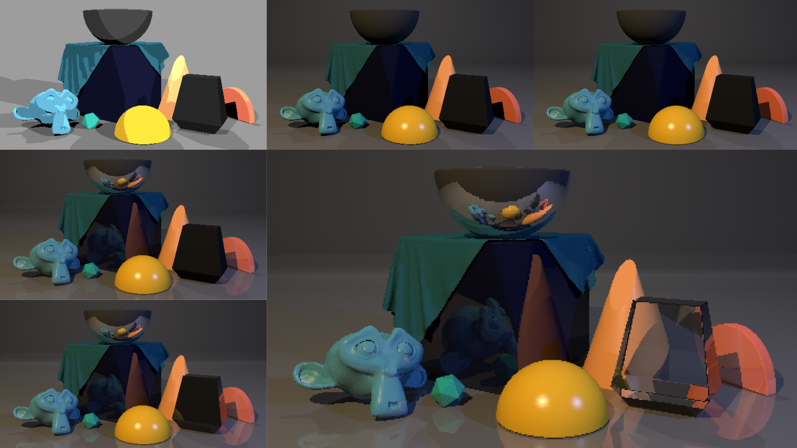

 

## At-a-glance

For CS148: Introduction to Computer Graphics, my partner and I rendered a scene using the Blinn-Phong reflection model, adding a shadow ray, ambient light, reflection, fresnel, and transmission. This was done using a ray tracing algorithm using recursion to approximate how a surface interacts with light. 

    

      <h3>Role</h3>
      
Developer

    

    

      <h3>Tools used</h3>
      
Blender Python 

    

    

      <h3>Team</h3>
      
Vivian Xiao

    

    

      <h3>Timeline</h3>
      
1 week, October 2021

    

---

## Project Overview

The Blinn-Phong reflection model method breaks up lighting into diffuse, specular and ambient reflection. This simple recursive ray tracer is used for mirror-like objects (e.g. metals, water) which reflect light or transparent objects (e.g. glass, water) which need light to pass through. Vivian and I implemented a simple recursive ray-tracing algorithm to model glass and reflective surfaces in the scene. 

While I can't disclose the details of my project implementation due to Stanford's Honor Code, feel free to [contact me](mailto:amyflo@stanford.edu) if you would like to learn more.

### Demo

