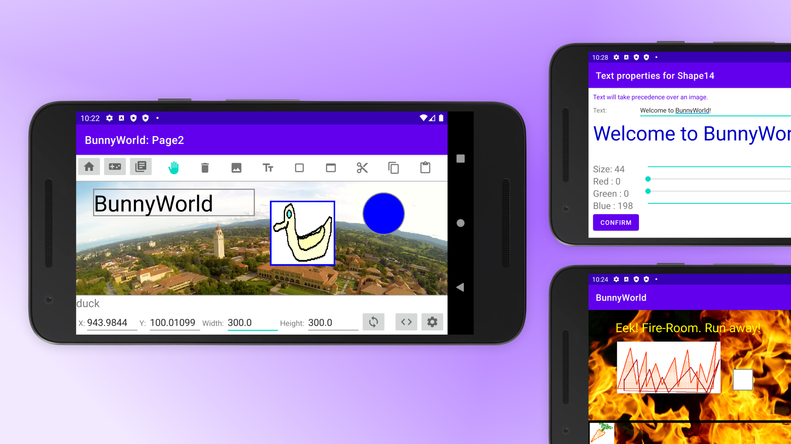

 

## At-a-glance

BunnyWorld is a group project I worked on for [CS108: Object-Oriented Programming](https://web.stanford.edu/class/cs108/). After learning Java and Android development, we developed a game editor and game player that featured object, image, text drawing and scripting. It was exciting to me that we could build a full Android app after just 8 weeks of class. For our project, we got to create over 30 unique extensions on top of the requirements that awarded our project a final grade of 109%.

    

        <h3>My Role</h3>
        
UX Design 
        Frontend & Backend Development 
        Android testing 
        Java Class Design 
        

    

    

      <h3>Tools used</h3>
      
Android SDK Java Material UI Whimsical 

    

    

      <h3>Team</h3>
      
Phil Chen Jin-Hee Lee Sarah McCarthy Victoria Helm

    

    

      <h3>Timeline</h3>
      
3 weeks, March 2021

    

---

## Project Overview

On a macro level, I was working on the game editor, user interface design, and scripting across games. I also implemented on touch events across the app, image previews, shape drawing, gameplay possessions, and cut/copy/paste across games. While I can't disclose the details of my project implementation due to Stanford's Honor Code, feel free to [contact me](mailto:amyflo@stanford.edu) if you would like to learn more.

### Walkthrough
Here is a video walkthrough of some of the key features of our app, recorded by my team member Phil. In this video, Phil plays a game and demonstrates some of our game editing and game play features.  
<iframe width="640" height="350" src="https://drive.google.com/file/d/1OYN8IPep7VYDl1KFbidMB9kN1n0Jwc_Q/preview" title="BunnyWorld player" frameborder="0" allow="accelerometer; autoplay; clipboard-write; encrypted-media; gyroscope; picture-in-picture" allowfullscreen></iframe>

---

## Takeaways

This was a fun and memorable project! I would have never thought that I would be able to build an entire app with my group in just 3 weeks (and during finals week, no less). We designed this app from end-to-end over many countless late nights, and I am really thankful for the chance to work with my team and make connections with them. Here are some of the biggest takeaways from this project. 

### Be a dauntless debugger

I've never met a developer who loves to debug wacky issues, and I certainly can't claim that I do. I realized how easy it is to get stuck on a bug and spend hours on an issue when faced with a nasty bug that seems to appear out of nowhere. However, after debugging and pair programming with my tea, fixing bugs felt less and less scary. This really resonated with me as someone who came into this project apprehensive and scared of code crashing, and built my confidence as a new Android developer. 

### Break your code down

When working in a group, I quickly learned that having a clear, practical structure to our Java classes was the most important part of our project. With so many moving parts and often conflicting pushes to git, having frequent discussions about how we were designing our software was vital to our project. With file saving, serializing, and so many complex features happening simultaneously, our project got pretty big. Breaking code down into small feasible parts to test, debug, and implement made our project feel more manageable and gave us a strong foundation for future features.