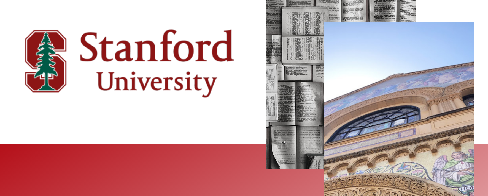

---

## Year 1
### Fall 2019
* **CS 106A:** Programming Methodology (Python)
* **MATH 51:** Linear Algebra, Multivariable Calculus, and Modern Applications
* **PSYCH 1:** Introduction to Psychology
* **UAR 101A** Frosh 101

### Winter 2020
* **ME 110:** Design Sketching
* **PSYCH 195:** Special Laboratory Projects (Research with Jeanne Tsai)
* **PHYSICS 41:** Mechanics
* **PWR 1SEA:** Writing & Rhetoric 1: Cross-Cultural Rhetorics: Writing About Cultures and Communities Around Us
* **STATS 60:** Introduction to Statistical Methods: Precalculus (Language: R)

### Spring 2020
* **CS 106B:** Programming Abstractions (Language: C++)
* **PSYCH 45:** Introduction to Learning and Memory
  * Cognitive Neuroscience and applications from machine learning
* **PSYCH 70:** Introduction to Social Psychology
* **PSYCH 136:** Self and Society: Introduction to Social Psychology
* **PSYCH 195:** Special Laboratory Projects (Research with Jeanne Tsai)
* **THINK 69:** Emotion
  * Psychology and philosophy rhetoric course combining biology and theory

---

## Year 2

I took a gap year to work at the Lenovo, the U.S. Census Bureau, and 50+1 Strategies due to the pandemic. 

### Winter 2021 (Flex)
* **CS107:** Computer Systems and Organizations
