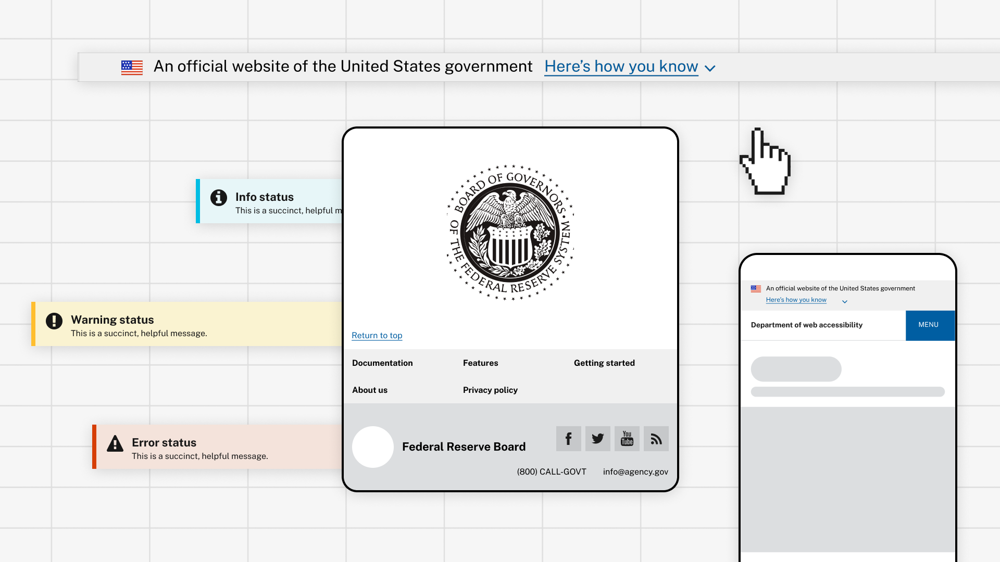

 

## Introduction

I spent my summer 2021 at the Federal Reserve Board, working on the design system and building a reference site from scratch on SharePoint online. I also contributed to adding copiable code components into the design system for developers to easily use in their projects. Case study coming soon – just finished wrapping up my project!

- **Team members:** Sarah Khan, Amanda Stiefvater
- **Role:** UI/UX Intern
- **Tools:** Adobe XD, JavaScript, HTML, CSS, React
- **Duration:** June 2021 - Present
