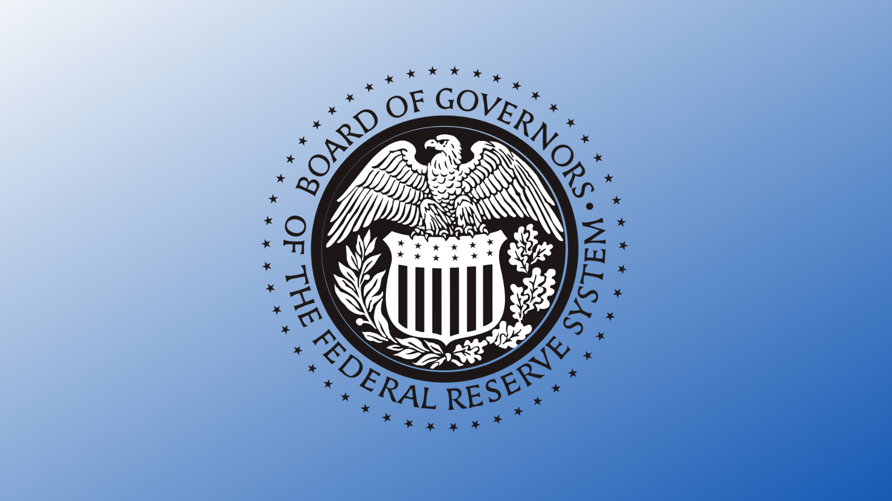

 

## At-a-glance

I spent my summer 2021 at the Federal Reserve Board, working on the design system and building a reference site from scratch on SharePoint online. I also contributed to adding copiable code components into the design system for developers to easily use in their projects. 

    

      <h3>Role</h3>
      
UI/UX Intern User Research Frontend Development UI Design

    

    

      <h3>Tools used</h3>
      
Adobe XD JavaScript Sass HTML/CSS React

    

    

      <h3>Team</h3>
      
Richard Moyles Samantha Perillo  Alexander Leopold Laura McHugh Sean O'Leary

    

    

      <h3>Timeline</h3>
      
5 months, June - November 2021

    

---

## Project Overview

From June 2021 - September 2021, I was an intern for the Federal Reserve Board of Governors. For my project, I rewrote and redesigned frontend and UI templates for Internal Technology Management Team’s design system. In addition, I also conducted usability testing and user research interviews to prioritize feature roadmap on SharePoint Online. Our design system is based on the [U.S. Web Design System](https://designsystem.digital.gov/), so I also spent time adapting and customizing components for our developers. By the end of my internship, I successfully deployed a new design system website and client-facing UI, updating 15 components. 

Although I can't disclose the details of my project due to the NDA, feel free to [contact me](mailto:amyflo@stanford.edu) if you would like to learn more.

