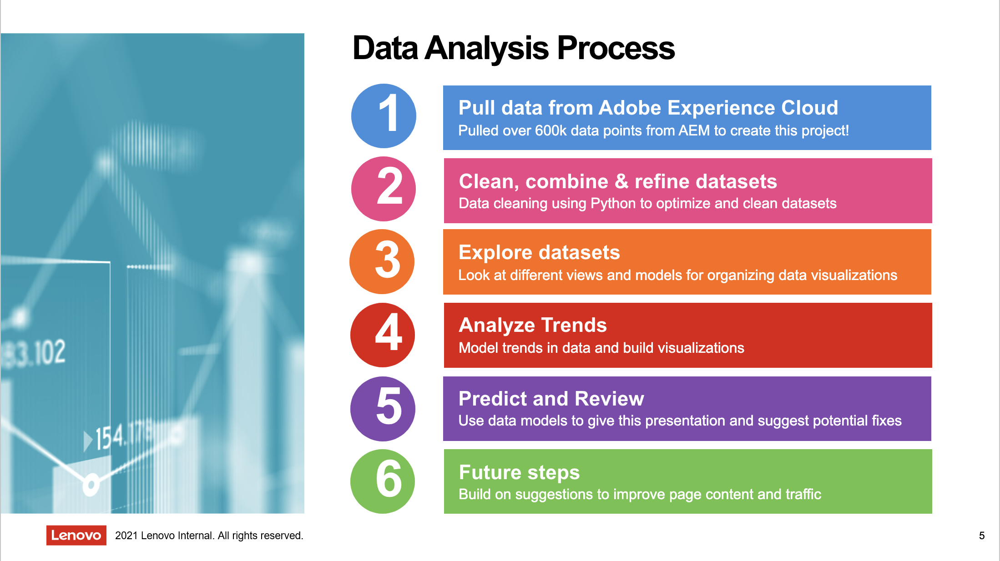
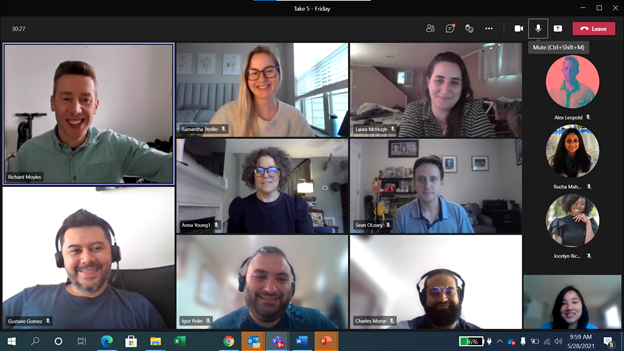

 

## Introduction

I spent my spring of 2021 at Lenovo, working remotely from home in Southern California. I worked as a Global eComm Content Operations intern on the Worldwide eCommerce team, where I got to present to one of Lenovo’s Chief Marketing Officers (CMO), help launch 18 different products, analyze and save millions of dollars in revenue and try my hand at content strategy. [Read more about my time at Lenovo on Medium.](https://amyflo.medium.com/?p=1c49f11e8f03)

- **Team members:** Richard Moyles, Samantha Perillo, Alexander Leopold, Laura McHugh, Sean O'Leary
- **Role:** Global eComm Content Operations Intern
- **Tools:** Adobe Illustrator, Adobe Photoshop, Adobe AfterEffects, R, Python, Tableau
- **Duration:** 5 months, January - June 2021

## Recommendations

"The future is incredibly bright for Amy, and she will be a valuable member of any team. Her ability to juggle multiple projects concurrently, learn new concepts quickly, communicate effectively, and get along well with anyone make her a standout candidate for any position. It was an absolute pleasure working with Amy and I recommend her highly." 

**- Sean O'Leary, eCommerce Content Producer at Lenovo**

"Amy joined our team on an intern program in spring 2021 supporting our wider content team. I immediately knew Amy had a talent combined with a collaborative approach and determination to do well. Amy worked across many complex areas demonstrating repeatedly an ability to learn new things and challenge herself." 

**- Richard Moyles, Global Content Director eCommerce at Lenovo**

[Read full recommendations on LinkedIn.](https://www.linkedin.com/in/amyflo/)

