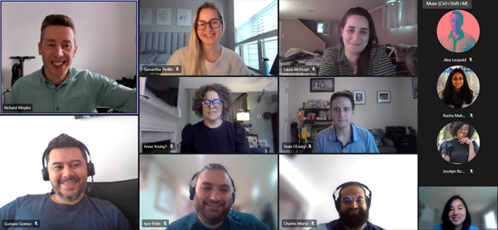

 

## At-a-glance

Over the spring of 2021, I worked as a Global eComm Content Operations intern on the Worldwide eCommerce team, where I got to present to one of Lenovo’s Chief Marketing Officers (CMO), help launch 18 different products, analyze and save millions of dollars in revenue and try my hand at content strategy. [Read more about my time at Lenovo on Medium.](https://amyflo.medium.com/?p=1c49f11e8f03)

    

      <h3>Role</h3>
      
Global eComm Contents Operation Intern

    

    

      <h3>Tools used</h3>
      
Python Tableau R

    

    

      <h3>Team</h3>
      
Richard Moyles Samantha Perillo  Alexander Leopold Laura McHugh Sean O'Leary

    

    

      <h3>Timeline</h3>
      
5 months, January - May 2021

    

---

## Project Overview

During the spring of 2021, I was an intern for Lenovo's WorldWide eCommerce team. For my project, I developed dashboards and data visualizations using Python and Tableau for 50,000 web pages in 164 countries, totalling
$807 million in revenue. While at Lenovo, I also had the chance to individually presented on internal recommendations to the eCommerce CMO, and I also conducted user research on site pop-ups and purchasing preferences across Lenovo.com with the UX team. Although I can't disclose the details of my project due to the NDA, feel free to [contact me](mailto:amyflo@stanford.edu) if you would like to learn more.

### Snapshots from my final presentation

  

    
  

  

    
  

---

## Takeaways

### Advocate for yourself and your abilities whenever you can

Before I even started at Lenovo, I was a nervous student who decided to take a gap year in the middle of the pandemic. When I finally got my offer letter, it was for 10 weeks in the summer — not spring. I jumped on a call with my future manager and outlined why I’d be a good fit to jumpstart my internship.

Surprisingly, my manager said yes — and that’s how I converted a summer internship to five months at Lenovo. If I hadn’t made the jump to stand up for my abilities and the potential that I could bring to my team, I wouldn’t have gotten where I am now in my early career.

### Design thinking doesn't stop when you stop designing

Actually seeing how data from our site pages and understanding how different landing pages and product launches could affect revenue made me more conscious of the way I designed. In a corporate world, each design decision that someone makes for a page could impact people’s livelihoods and KPIs across a business — a point that will be sure to stick with me as I move on.

---

### Recommendations

"The future is incredibly bright for Amy, and she will be a valuable member of any team. Her ability to juggle multiple projects concurrently, learn new concepts quickly, communicate effectively, and get along well with anyone make her a standout candidate for any position. It was an absolute pleasure working with Amy and I recommend her highly." 
**- Sean O'Leary, eCommerce Content Producer at Lenovo**

"Amy joined our team on an intern program in spring 2021 supporting our wider content team. I immediately knew Amy had a talent combined with a collaborative approach and determination to do well. Amy worked across many complex areas demonstrating repeatedly an ability to learn new things and challenge herself." 

**- Richard Moyles, Global Content Director eCommerce at Lenovo**

[Read full recommendations on LinkedIn.](https://www.linkedin.com/in/amyflo/)

