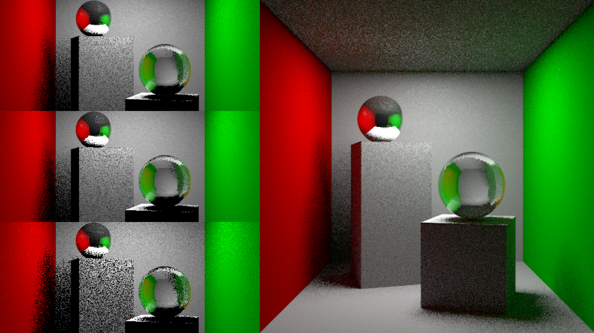

 

## At-a-glance

The Monte Carlo method is a way to render images of 3D scenes to have realistic global illumination. Global illumination refers to when light bounced from other objects are also used to illuminate the scene. For CS148: Introduction to Computer Graphics, my partner and I rendered a variant of the classic Cornell Box Scene This demo renders a variant of the classic Cornell Box scene, implementing area lights, sampling, and global illumination. 

    

      <h3>Role</h3>
      
Developer

    

    

      <h3>Tools used</h3>
      
Blender Python 

    

    

      <h3>Team</h3>
      
Vivian Xiao

    

    

      <h3>Timeline</h3>
      
1 week, October 2021

    

---

## Project Overview

Building off of our [Blinn-Phong simple recursive ray tracer](blinn-phong), Vivian and I implemented a Monte-Carlo recursive ray tracer using indirect diffuse lighting in stages. Using low-discrepancy sequencing and simple sampling, we gave our image the effect of “filling in gaps” so that a given area can be covered more evenly and quickly compared to the completely randomized approach. 

While I can't disclose the details of my project implementation due to Stanford's Honor Code, feel free to [contact me](mailto:amyflo@stanford.edu) if you would like to learn more.

### Demo

