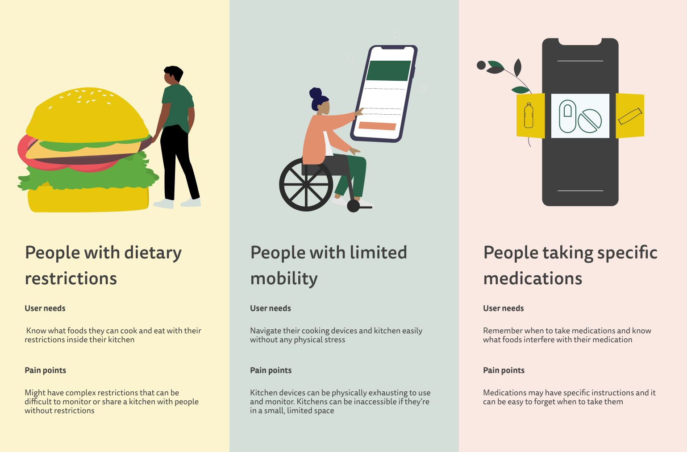

 

---

## Introduction

Designed for people with limited mobility, dietary restrictions, and specialized medications, Nutrikitchen is a hub for managing your wellness and kitchen without ever leaving the app. In this concept app, I participated in a team of two with my partner, Tracy Do. Nutrikitchen was a finalist for Adobe College + Ring Creative Jam, scoring in the top 10 out of 130 teams!

- **Team members:** Tracy Do
- **Role:** Product Designer
- **Type:** Design Competition
- **Tools:** Adobe XD
- **Duration:** 1 week, June 2021

---

## Challenge

### Prompt

>>> “Your challenge is to provide peace of mind and help people install, operate, or share devices and information to improve their surveillance, communication, temperature, and entertainment around the home and their neighborhood. Design an inclusive third-party mobile app for a specific persona with special needs to help bridge the technology gap.”

### Concept

Nutrikitchen is an all-in-one smart kitchen and health app that understands your medical needs. It functions as a companion to smart kitchen devices that makes it easier for people to manage their diet, lifestyle, and cooking as a centralized app. Nutrikitchen empowers people of all abilities and health needs to manage their lifestyle and kitchen safely and with delight.

---

## Solution Preview

<figure></figure>
<figure></figure>
<figure></figure>

## Overview

### Constraints

- Mobile app that solves an accessibility need
- Work with new or existing smart devices
- Both of us were first-time users to Adobe XD
- Brief project timeline to complete

### Users

To start our design process, we decided on designing around these three groups who we felt would benefit most from a smart kitchen app.

---

## About the event

### Adobe College + Ring Creative Jam

Adobe College + Ring Creative Jam was an event for student designers across the United States, Canada, Australia, or New Zealand. Teams have a full week to work. All submissions are scored by a judging panel of professional designers. At the Finale, finalist teams present live to a panel of expert judges from Ring and Adobe XD.

---

## Process

### Defining the problem space

To start our design process, Tracy and I went through the phases of the design thinking canvas, thinking clearly through the people, challlenges, storytelling, problem, solutions, management, vision and impact. We used this as a gauge to evaluate the strength of our ideas and make sure that we were always creating with our users in mind.

## Ideation

### Early features

Before we started designing, Tracy and I wanted to determine which features our app should have and where they should live. Using post-it notes, we moved ideas around our artboard until we felt comfortable and confident about the placement of our features.

### User flow

For the user flow of our app, Tracy and I mapped out the different interactions in our app based on our initial brainstorm of features. We decided to color code our interactions in the user flow to ensure that we knew all the screens and actions we wanted to include. This also served as a reference for us later when prototyping our design.

### Wireframes

To create our wireframes, we referenced styles from Adobe XD UI Kits. It was difficult to wireframe at first because both of us were new to Adobe XD and were sometimes working asynchronously on the project. Because of a tight schedule, we jumped from wireframing to visual design after agreeing on each screen.

### Design System

We built a modular, component-based design system to prioritize consistency and usability across our product. For our design system, we struggled with choosing a color palette that would fit our concept. We gained experience on customizing reusable assets and built branding and components as part of our app. We wanted the Design System to portray comfort and ease and displayed through cooking and health. We chose a color palette that plays into the food and nutrition theme.

### Prototyping

Prototyping on Adobe XD was new for us and we had multiple screens with complex actions and microinteractions. We relied heavily on our user flow diagram to plan out interactions in our app and took advantage of Adobe XD’s smart-animate and timing features to create visual delight in our screens.

    <video preload="auto" autoplay="autoplay" loop="loop" controls      style="max-width: 100%; height: auto;">
    <source src="https://i.imgur.com/FiNahgC.mp4" type="video/mp4">
    </video>

---

## Solution

### View the [interactive prototype here.](https://xd.adobe.com/view/9da0b7ce-cdd0-4cd9-a641-445b3358716c-c8f3/?fullscreen)

Here is our final solution!

> Solution #1: Smart Refrigerator (Dietary Restrictions)
Nutrikitchen regulates your dietary needs by keeping track of the foods you eat and what’s inside your refrigerator.

- Alert to buy groceries if food is running low / almost expired
- See nutrition details of all foods in your fridge
- Recommend foods that users can and can’t eat with their diet

> Solution #2: Smart Stove (Limited Mobility)
Nutrikitchen helps people control kitchen appliances from your phone without the physical stress of cooking. Through Camera View and heat-detection, our app understands when you’re cooking and will safely monitor your next meal.

- Recommend modes of cooking based on your meals
- Autonomy over your cooking experience
- Override and/or cook manually if needed

> Solution #3: Medications & Reminders (Specialized Medications)
Using motion detection, Nutrikitchen will alert you when you grab foods that may be hazardous for your health or interfere with your medication.

- Recommend foods that users can/can't eat with their medication
- Medication reminders customized to your times
- Warnings and safety reminders about your medications

---

## Results

### Awards

> We became Top 10 finalists out of 130 teams!

Our app was evaluated on the following criteria:

1. Does the solution address a target audience and their needs?
2. Does the prototype solve the problem in an innovative way?
3. Is the user experience and interface intuitive?
4. Is visual design used in a thoughtful and meaningful way?

We received notification that we made it to the top 10 and had a few days to prepare for the next round! As finalists, we presented in the Finale with a live 3-minute demo of our app and its user flow.

<iframe width="560" height="315" src="https://www.youtube.com/embed/oZZ7ermTic0" title="YouTube video player" frameborder="0" allow="accelerometer; autoplay; clipboard-write; encrypted-media; gyroscope; picture-in-picture" allowfullscreen></iframe>

### Feedback

> "This is definitely a really, really cohesive app in terms of the designs and the concept, too. I think the illustrations are really great, and the theme is tied together really well!" - Justin Fulller, Amazon / Ring (Product Experience)

After our presentation, our judges gave feedback on our app design, valuing its layout and understanding of design principles the most. They offered us advice on how to improve our app to make it more accessible and easy to understand for individuals like the elderly.

## Takeaways

### Deliver to user expectations

One thing that we learned was how to better address user needs in our presentation. Having to synthesize and compete under pressure against finalists helped us really learn how to elaborate on our work and make it clear who our users were in our script. However, it was a learning opportunity to match the expectations of our stakeholders, the judges. Because they had more of a product background, it would have been valuable in our ideation to consider some of the long-term product questions that would have come up if this was a real app.

### Refine the scope of the project

Our app was really complex and had many moving parts for the features. Simplifying the project to an understandable user flow could have made our presentation easier to understand for our judges and may have made us more successful. We also could have conducted user research if we had more access to our target users to make our design decisions more nuanced and valid.

### Time management throughout the design process

Good time management helped alleviate the stress that could have come with our tight timeline. Tracy and I were both working our internships during the competition process, so balancing our work together asynchronously helped us quickly iterate through screens and ideas. This was definitely a lesson learned for us for how to do GOOD work quickly and iteratively without sacrificing quality.

---

## Next Steps

### Usability testing

#### How might people with different abilities and complex needs use our product?  

It was important for us to consider after our completionn of the project whether or not this would be feasible for different groups. Ideally, we would make more corrections to our app's user flow to make it feel more intuitive for users of different technology needs and backgrounds.

#### How might we design for shared households that may all use the same appliances?

Our app solution centered around one inndividual with medical and dietary needs. It might be interesting to explore what our app could look like with families or larger groups that might share smart kitchen appliances.

### Feasibility and Execution

#### Could our project actually be executed as an MVP?

Our app was very complex. Questions following our design were around whether or not our interactions would work with smart technology and how it would be able to integrate multiple smart devices into one app.

### Product roadmap

#### What steps would we take to make this real?  

Our reliance was on smart kitchen technology that may not exist with the features we want. While we're competing in a relatively under-developed market, many of the features we would want may not integrate or exist with the current technology.

Another step we could take would be working with the UI of physical appliances.  Designing for smart devices has to fit both the material and digital constraints. This led us to question: How would physical appliances interact with our app? How would our UI be constructed to fit material needs?
