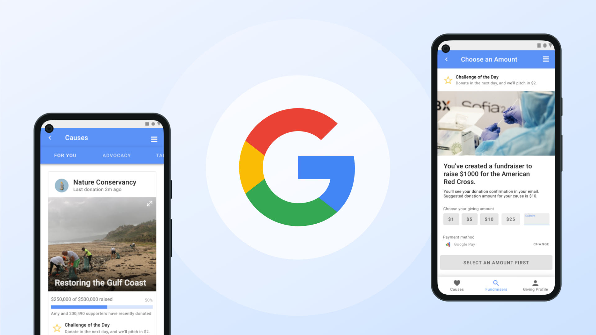
 

## Introduction

### Prompt

Google OneToday was an Android-only app that aimed to get people to donate a dollar everyday that launched in 2013. It entered the “Google Graveyard” in 2020 when Google shut down the app due to a decline in use. In this project, I worked in a team of two designers to redesign Google OneToday to avoid some of the reasons why it failed!

This project was a third place winner for Wellesley’s 2021 REVIVE Designathon.

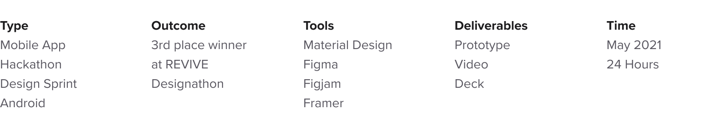

---

## About the event

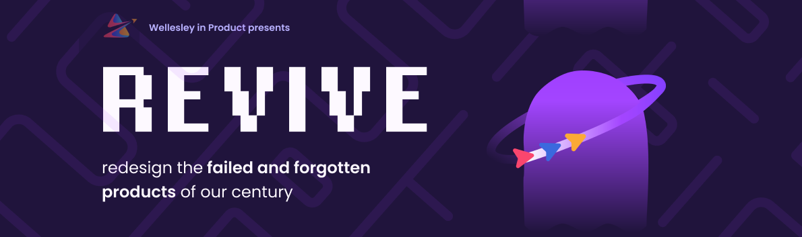

### REVIVE Designathon

REVIVE is a designathon challenging participants to redesign a failed or forgotten product hosted by Wellesley. For 24-hours, participants chose a product to create an improved innovation. My partner was Sathya Edamadaka, who had never designed before this competition! Our project won third place, and we got the chance to present together during awards.

---

## Solution Preview

<figure>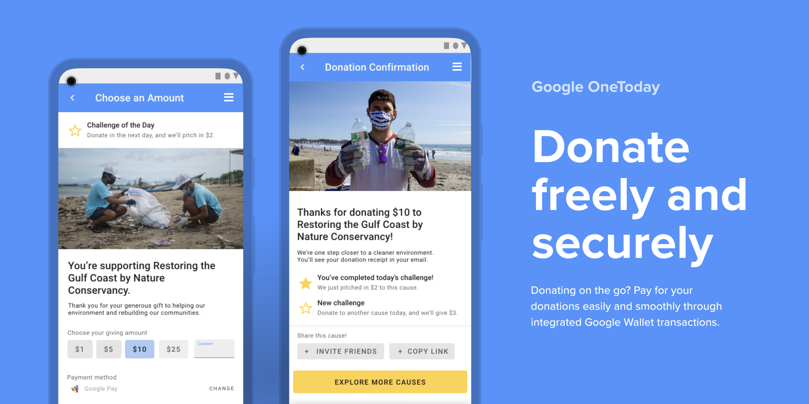</figure>
<figure>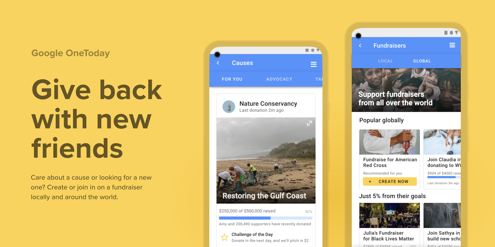</figure>
<figure>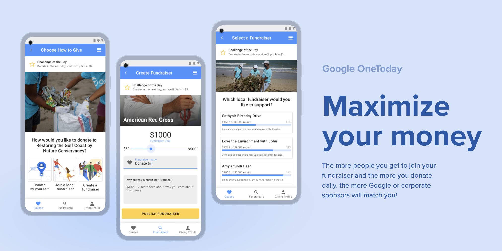</figure>

---

## Background

### Overview

Google launched One Today in 2013 as a way to encourage people to donate one dollar to nonprofits every day. It made 1.9% off of each dollar donated. OneToday had huge potential for positive impact: it recommended causes daily and showed you how your money was spent.

### Why did One Today fail?

One Today failed to maintain their user base, which ended up dispersing to other donation platforms. One Today relied on credit card transactions through Google Wallet to fund its app – without enough transactions being made daily, it would not be able to keep going.

### Challenge

Redesign the One Today app to drive daily donations based on social interactions and challenges. Create an Android app to help donors find new fundraisers and create their own to share with friends and family.

### Timeline

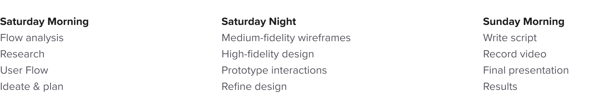

---

## Research

### Flow analysis

In order to rethink the product strategy and overall redesign, we first had to create a user flow to understand how users previously donated on the app. This was incredibly challenging because the app had ended last year, so we had to rely on old press releases and screenshots in order to piece together the user flow of the app.

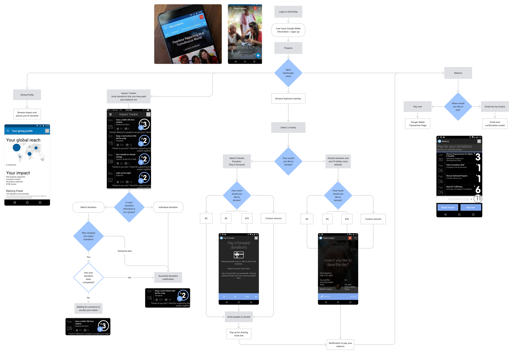

### How One Today failed

> Problem #1: By yourself, you could only give $1 to a project per day

This was a limit on the amount of money that you could give to projects you cared about. People naturally migrated to other products like GoFundMe that offered more flexibility in how much you could donate.

Paying for your donation was a separate process in the user flow outside of making a donation. The transaction mechanism disincentivized users from returning with a 2-step method where you paid for all your "pledged" donations in bulk instead of right after each donation.

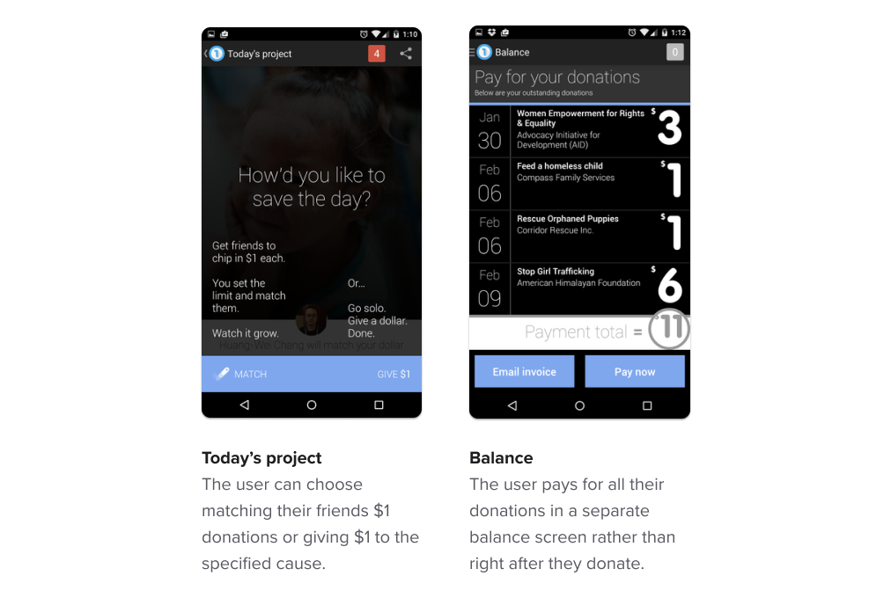

> Problem #2: Donating is social, but One Today didn’t make that easy

One Today offered features like donation matching for you and your friends, but your donations functioned as pledges instead. Your friends could use your pledged amount to donate to causes on your behalf, but the payment didn't go through until you paid for your pledge later on.

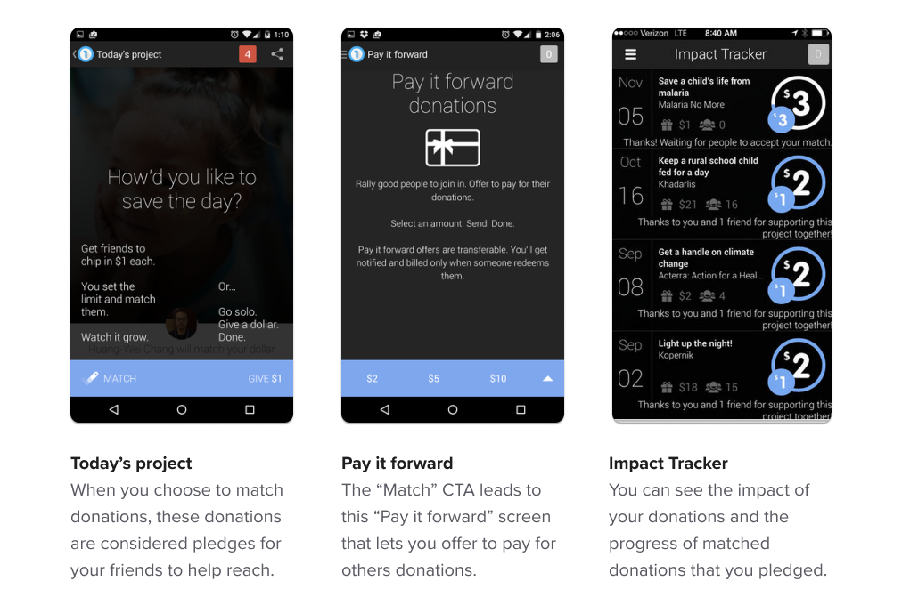

> Problem #3: It’s hard to donate daily without an incentive

Donating is inherently social – we're drawn to give back from emotional, human stories. One Today didn’t incentivize people enough to donate every day beyond the initial download. Because not enough people were revisiting the app to make credit card transactions, Google couldn’t create enough revenue to keep the program.

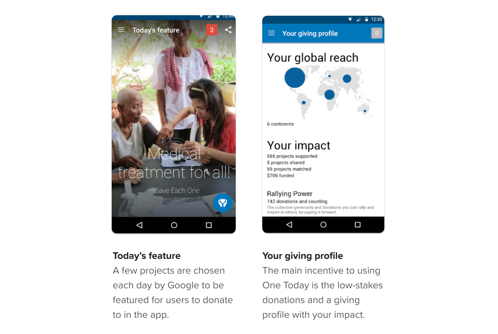

---

## Defining the problem space

Originally, we brainstormed ideas around how we could introduce new features around match rates inspired by investing apps like Robinhood. However, when we realized we went too far in our brainstorm, we revisited our core product strategy to keep our HMW question in mind:

> How might we get help donors to stay socially and financially engaged with the giving community?

### Key opportunity areas

1. Remove friction to donating in the transaction process
2. Make donating feel as social as possible
3. Recommend fundraisers in their area
4. Help people team up to expand their impact
5. Provide a reason to come back everyday

---

## Ideation

### Early Exploration

Before we started designing, Sathya and I explored different ideas about what the app should be like, exploring new and existing features as we settled on our new product. That led us to come up with the idea of "pools" for donating. We originally were inspired by products like Venmo or Uber where you can split rides and transactions between users.  We also visually explored a few layouts on Figjam before jumping into our user flow.

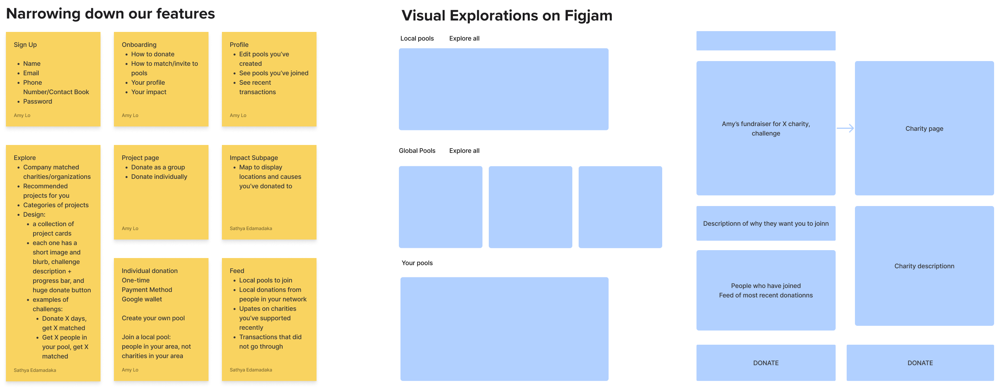

### Revised User Flow

For the user flow of our app, we spent about two to three hours working out the different interactions that a user would take when donating on the app. Our flow was created by iteratively asking questions: each time we proposed a new feature, we both thoroughly asked and probed at it to make sure that what we introduced made sense. It also helped that Sathya had a more technical background in development to judge the feasibility of different product decisions.

#### Sample questions

* How would a user find and explore new causes?
  * Explore - see suggested by causes
* Where would they be able to manage transactions & wallet info?
  * Profile - manage their balances and recent donations
* Where would a user find local or global fundraisers?
  * Pools, later renamed to Fundraisers

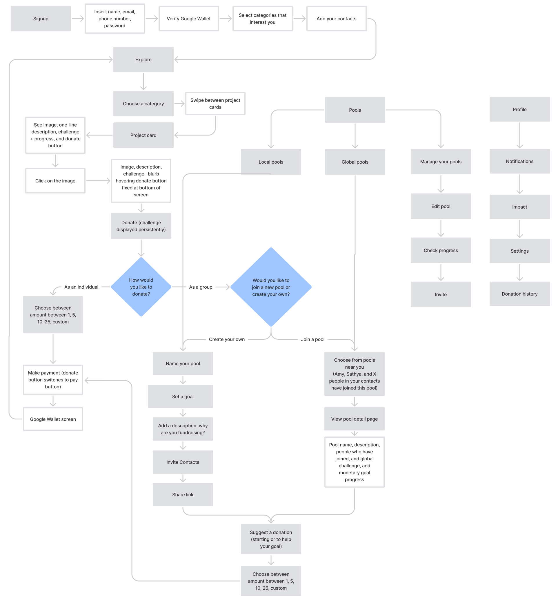

### Wireframes

Because we only had 24 hours for the whole event, we jumped straight into medium-fidelity wireframing in order to ensure that we had enough time to prototype. Unfortunately, we were not able to conduct usability testing beforehand due to time constraints. However, we based much of our design off of Material Design principles and components to maintain consistency within our app design to fit with Google's brand. We also revised our language to reframe "pools" as fundraisers later on as to feel more intuitive to the user.

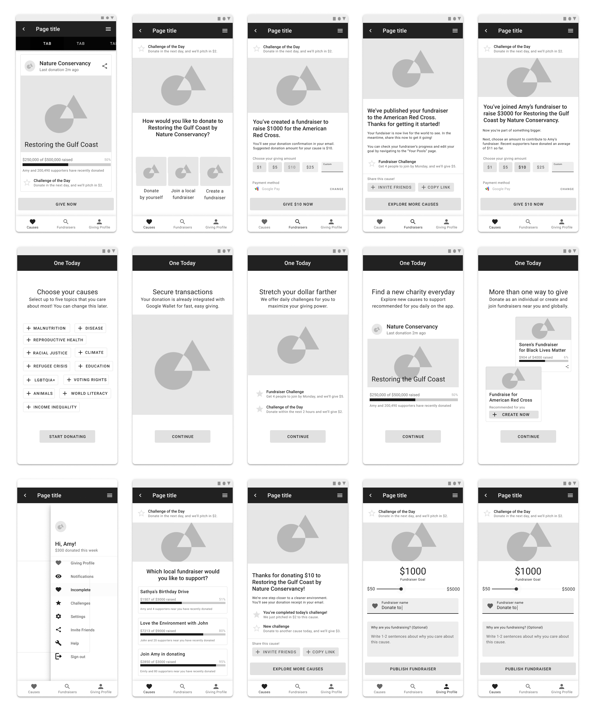

---

## Solution

### View the [interactive prototype here.]("")

Once we decided on our final design, I threw everything into Framer to animate and prototype the project while Sathya started on our presentation and script. After 24 hours of intense, sleep-deprived work, here is our final solution!

    <video preload="auto" autoplay="autoplay" loop="loop" controls      style="max-width: 100%; height: auto;">
    <source src="https://i.imgur.com/WChFpRq.mp4" type="video/mp4">
    </video>

---

> Solution #1: Donate freely and securely  
We’ve removed the cap on donations. You can now give as much as you want to new causes every day. For fundraisers, we’ve simplified the donation process. You can now pay it forward sooner, rather than later. Unlike the old OneToday, you pay for your donation immediately, and you’re suggested an amount to donate based on other supporters’ recent activity. Once you’ve made your payment, we confirm your donation has gone through and encourage you to share it with your friends and family.

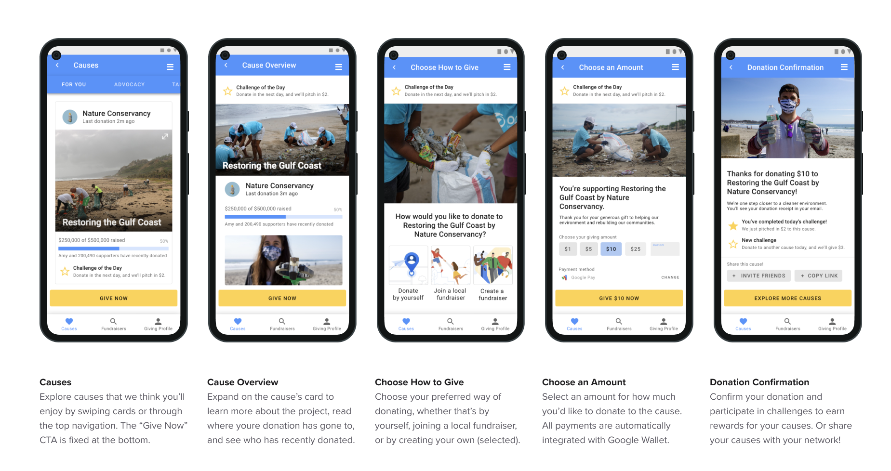

> Solution #2: Give back with new friends  
Explore recommended, local, and global causes selected just for you. When joining a fundraiser, you can choose to donate as a group by making your own fundraiser or joining a local one hosted by neighbors in your area. When joining a local fundraiser, we'll recommend a few based on your geographical proximity to help you create and sustain new connections.

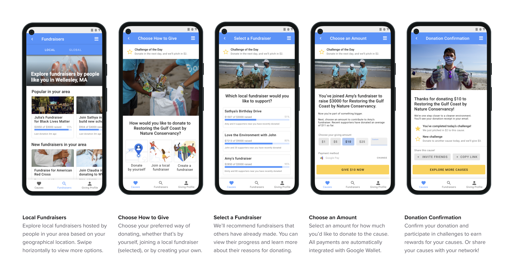

> Solution #3: Maximize your money  
We’re introducing challenges for being a part of OneToday: the more people you get to join your fundraiser and the more you donate daily, the more Google or corporate sponsors will match you. You can personalize a fundraiser by adding more about why you're supporting it to easily spread the word to donate. Challenges reset every evening, encouraging users to continue to come back daily. We’ll also encourage you to get involved by promoting all fundraisers you create around the world.

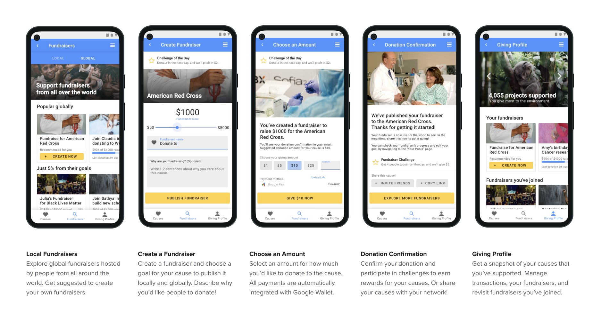

---

## Results

### Presenting our work

As part of our designathon, we had to design and present a deck outlining the changes and ideas we made to revive the failed product of our choice for the judges to score. Watch my partner Sathya present our deck on Google One Today below. Because we placed in the designathon, we also got to present our work together at the final awards ceremony as well!

<iframe width="560" height="315" src="https://www.youtube.com/embed/gdomjZfY3Vs" title="YouTube video player" frameborder="0" allow="accelerometer; autoplay; clipboard-write; encrypted-media; gyroscope; picture-in-picture" allowfullscreen></iframe>

### Awards

> Third place goes to Google One Today!

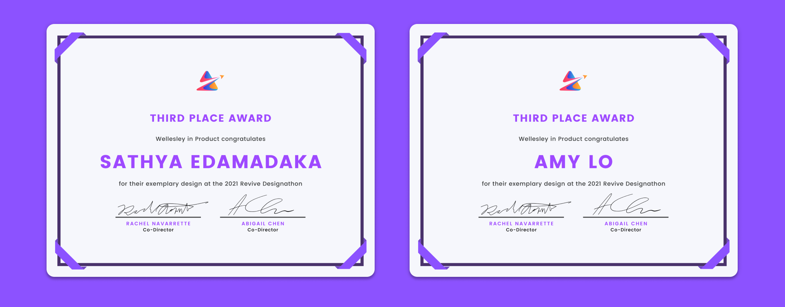

We were so excited to win third place after a stressful 24-hours of work. It was so validating for both of us, especially as this was the first time we entered a designathon and Sathya’s first time designing!

### Feedback

> “Great demo that clearly articulated the app you were reviving, the pains you identified, and how you were addressing them!” - Judge 3

After the competition, we received feedback from our judges that gave us ideas on how to improve for the future. They valued our delivery, strategy, and creativity the most within our new app concept.

> Thank you for "owning" this project. You've done a great job presenting this product as if it were your own and that translates well... Overall, I am VERY Impressed with the work this team has done!” - Judge 4  

---

## Takeaways

### Time management

Time management was definitely something that was difficult for us. We were also learning how to use Framer, Figjam, and Figma all at the same time so it was often difficult to learn the tools in the 24 hours provided.

### Animating adds an extra touch

We learned how to animate our prototype in Framer which was super impactful because it was fun to see our designs in action. It also helped us better translate some of our ideas and design decisions visually to the judges.

### Bring a strategy mind

We learned the importance of great product design and business sense. Often, we had to take out parts of our user flow and design because they didn't fit with our vision. We also had some parts of the design that we had to revise or toss out when they didn't seem technically feasible.

---

## Next Steps

### User research

We'd love to conduct further usability tests and test out the fundraiser logic by running some fundraisers of our own! It would be great to validate our idea through research to be able to measure the success of our solution.

### Lingering questions

How might we get companies to match donations? What challenges would excite users the most? How does this app compete against an already crowded space of fundraising apps? These are questions that I would ask if we were to turn this design into an MVP.
