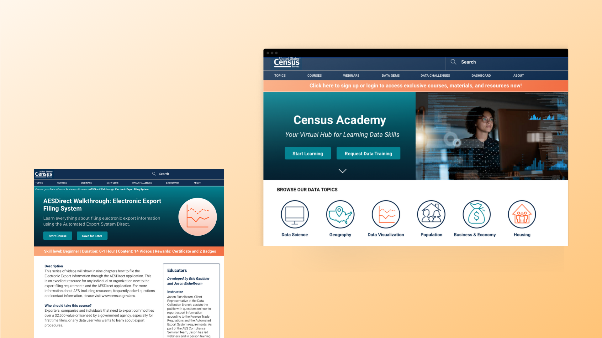

---

## Introduction

The Census Bureau was struggling with helping small businesses understand complex data tools and methods. The **lack of structured, digestible courses** left small businesses overwhelmed when trying to learn new tools that could help them understand their markets and withstand pressures faced by COVID-19. 

I redesigned the entire learning management system for the Census Academy. In this case study, I focus on its core: **a new approach to data skills courses for small businesses.**

* **Team members:** Elliott Tran, Mary Leisenring, Alexandra Barker
* **Role:** UX Designer
* **Type:** Internship
* **Tools:** Sketch, InVision
* **Duration:** 10 weeks

---

## What I didn't know
Before this project, I had never heard of of user experience before. I joined the Civic Digital Fellowship with Coding it Forward with zero knowledge of user research. Everything you see in this case study was self-taught from a combination of Medium, online courses, heavy reading, and great mentorship from the folks at the Census. While I had a graphic design background, this project was the first time I've ever used Sketch or InVision. My skills have definitely improved since then!
___

## Problem

My team wanted to create more engaging online courses geared toward small businesses. While we had a few courses available on the website, they existed only as text and embedded YouTube videos. We wanted to teach users in a more interactive way and build a better infrastructure for a learning management system. I was challenged to come up with a redesign as part of my fellowship with the U.S. Census Bureau that would be a part of a federal proposal for data education. 

---

### Examining the old flow

Here is what it looks like when a user takes a course through Census Academy.

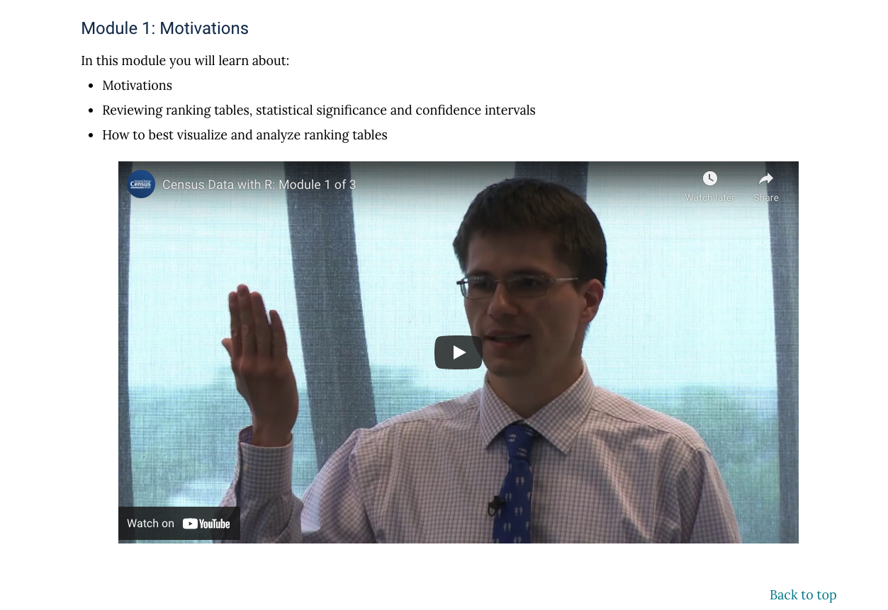

Each course exists as one long webpage with several embedded YouTube videos. Because there is no interaction with the user on the site, there is no incentive for a user to learn through the Census Academy courses. Even if a user does complete the course, there is no way of documenting their learning or measuring whether or not they have learned the material. 

---

### Too much burden on the user

Our target users were small business owners impacted by COVID-19. There were multiple pain points throughout the process of discovering / selecting a course and taking it that created friction in the learning process. A big priority for us was reducing the cognitive load it takes to enter and complete a course, and be able to measure quantitative data from our learners in the site.

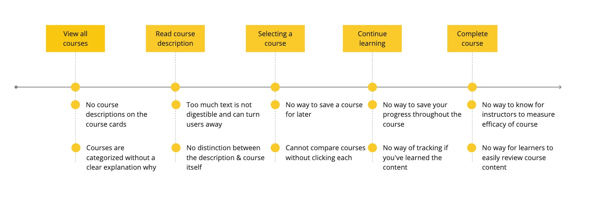

--- 

## Research

As part of the project, we wanted to understand the impact of COVID-19 on small businesses and how they use our data tools to make business decisions. We also interviewed small businesses to learn more about the impact of data Luckily, data is not hard to find here at the Census! We interviewed teams like Statistics for Schools and other data experts at the Census in order to discover more about small business behavior and interests. 

This was especially time sensitive because we wanted to consider the impacts of the COVID-19 pandemic on how small businesses would respond. A few of our key findings are highlighted below. 

---

### The pandemic poses a threat to small businesses

Any design solution we created had to reduce the barriers to entry for our users, who already had high stress and pressure from the pandemic. Looking at data from the [Small Business Pulse Survey][1], we could see that COVID-19 had a huge effect on our audience. 

#### [77.4% of businesses nationwide][1] have been negatively affected by the COVID-19 pandemic.

#### [30.3% of businesses nationwide][1] have had a large negative effect by the COVID-19 pandemic.

> “[COVID-19] was affecting our business in March and dropped our business by about 70%... If we have a second wave, I'm concerned that not just myself, but many of my peers will be in a very challenging position.” 

[1]: https://portal.census.gov/pulse/data/

With a huge proportion of small businesses facing difficulty from the pandemic due to national shutdowns and COVID-19 restrictions, it was important early on that we had to prioritize simplicity and accessibility. This finding later led us to using the US Web Design System to ensure that our website was WCAG-compliant. 

---

### Small businesses and data solutions go hand in hand

We also researched the existing data landscape for small businesses. When used effectively, data can be extremely powerful for finding new customer leads, measuring sales, and understanding a local market. 

#### [67% of small businesses](https://smallbiztrends.com/2020/03/data-analytics-trends.html) are spending more than $10K a year on analytics.

#### 83% of our user research participants rely on data analytic tools to make business decisions.

> “[Before the pandemic] we started working with a bunch of people who've essentially gone out of business, like brick and mortar stores. Most of them are non-existent. Our future was always going to be online.” - Participant 3

Despite these benefits, there is a high barrier to entry for using data. Through our user interviews, we learned there were two common reasons why: data tools were 1) expensive and 2) difficult to use. The Census Bureau already offers [eleven free data tools](https://www.census.gov/topics/business-economy/small-business/data/data-tools.html) that cater to small businesses. Our goal was to make them easier to learn. Thus, our focus shifted away in our design from teaching courses on data generally to teaching people how to use data tools. 

---

### Understanding the existing data education market

We examined how competitors in the e-learning space structured their courses to support interactive learning in a competitive analysis. 

> We learned that a successful online course prioritizes user retention through a gamified approach to learning, using progress tracking and rewards like points or certificates.

This process took two weeks because we tested more than 15 different sites to completion before deciding on an itemized list of features that we were most interested in including in our design. Those were included in a project proposal that I had to get approved by our Acting Chief of the Customer Liaison and Marketing Services Office before I could start designing.

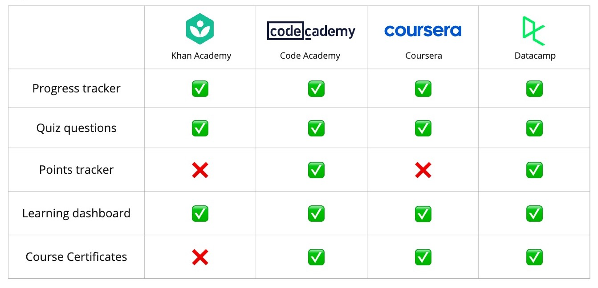

--- 

## Wireframes

### Creating for accessibility with USWDS

A new redesign needed to be scalable and easily buildable, so this design was based on components from the U.S. Web Design System, primed for accessible, mobile-friendly government websites. Wireframing with this system made it easier for the team to approve and give feedback. This also helped me, as a designer, iterate quickly without sacrificing on WCAG compliance. 

One of the key reasons we decided to use this design framework in the first place is because of the difficulty government groups have in approving software.
This was a constraint that my team and I had to work with to make sure that some of the ideas we had that could affect the backend of this product could still be approved. 

--- 

## Design

### The old user flow

Before we tackled the redesign, we wanted to discuss as a team how the user flow of a course could be fixed. First, we mapped out the current site's user flow.

**Key questions we arrived at:** 
1. How might we know if a user learned the material? 
2. How might we measure progress throughout the site?
3. How might we break down this design into maneagable chunks?

> Most importantly, we had our initial problem drive our solutions: 
>   How might we structure online courses about Census data for small businesses? 

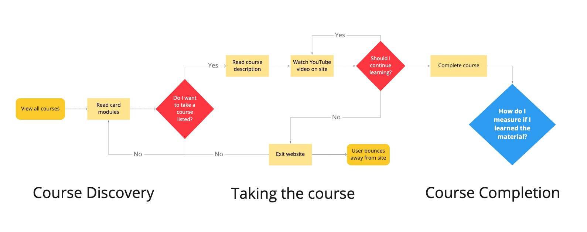

--- 

### Revising the user flow

To fix pain points in the previous version of the Census Academy, I tackled three parts of the old flow:

1. **Course Discovery:** How users are finding our courses and selecting them
2. **Taking the Course:** How we retain users on the site
3. **Course Completion:** How we measure user progress and site interaction

--- 

#### New flow #1: Course Discovery
For the course discovery, we wanted to create a dashboard where users could save, resume, and get recommended courses. We introduced this to help present any cognitive overload that a user might face when looking for a course.

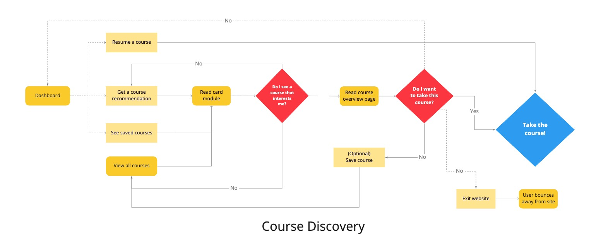

--- 

#### New flow #2: Taking the course
For the course discovery, we wanted to create a dashboard where users could save, resume, and get recommended courses. We introduced this to help present any cognitive overload that a user might face when looking for a course.

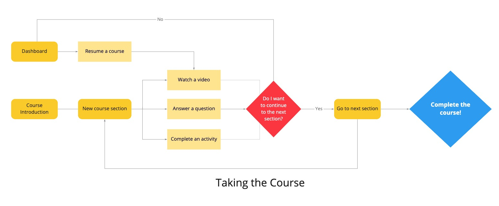

--- 

#### New flow #3: Course Completion
At the end of a course, we wanted a way for users to feel valued and incentivized to complete more courses. We added rewards like badges and certifications for completion, and redirected users back to the dashboard afterward where they can discover more courses to take.

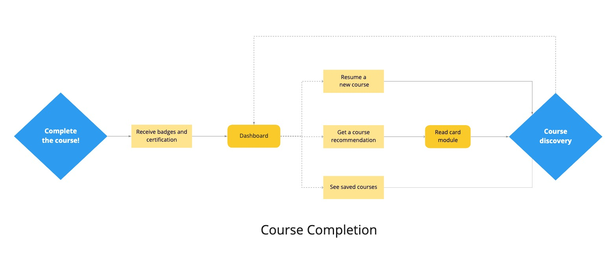

--- 

## Solution

After finalizing our designs, I prototyped the screens onto InVision so that we would be able to clearly compare the changes made from the original design. We also used our protoype in user research later on when we went on to validate our design. 

--- 

### Solution #1: Course Discovery

#### Solution 1.1: Combining topics and courses into one page

The Census Academy website has a Courses page as well as resource pages for each of its six topics. Because of the duplicative amount of work it would require the Census Academy team to maintain these pages, we decided to restructure the topics page to include the courses, allowing users the option to toggle between six icons to change the page topic.

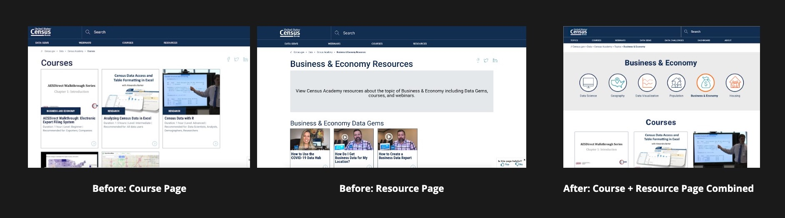

- **Design cues:** The icons used in the redesigned course topic pages are consistent across the Census Bureau. I decided to reinforce those brand icons so users familiar with other Census websites would easily understand where they are.

- **Efficient workflow:** The Census Academy had a small team and maintaining the site was already a challenge. By combining these pages into one, it would make it easier and more efficient for the content manager on the team to update the website.

---

#### Solution 1.2: New layout for cards

One of the flaws with the old card design was that there wasn’t enough information to understand the course. Furthermore, the tags (ex: “Research” on the leftmost card) categorizing the courses would often obscure the course image or be harder to see on darker images, limiting its accessibility. 

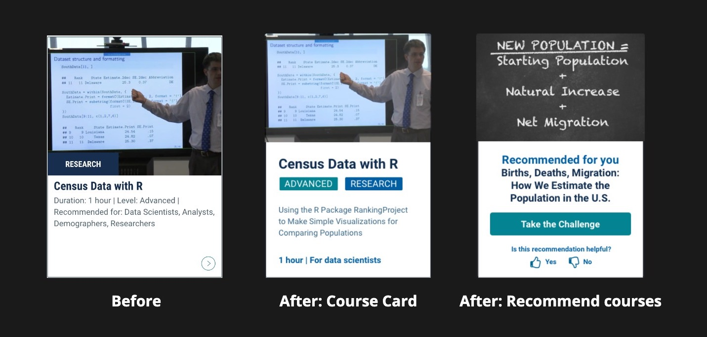

- **Course Card design:** I gave more white space to the card and emphasized relevant information in the new course card design. This would it easier for users to read and align with accessibility principles. I also added the description for each course into the card layout so that a user would not have to open each page to know what each course covers, improving each card's utility.

- **Course recommendations:** I suggested a new card layout that would give recommendations to users on courses they should take. As a reusable component, this card could be used throughout the site, offering a new selection for users who may be struggling to pick a course. Users can also rate the recommendation quality, helping the team to better recommend courses in the future.

---

#### Solution 1.3: Course overview
Previously, looking at the course description was extremely text-heavy and deterred users from diving into the content. 

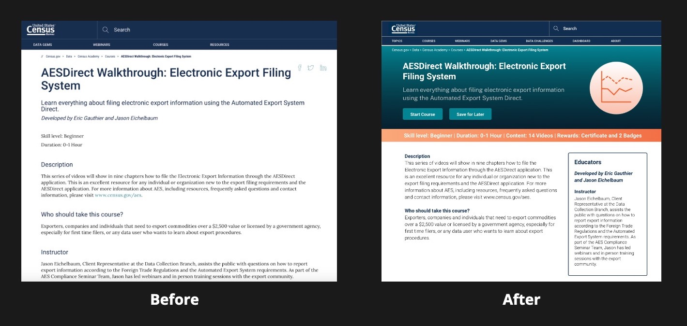

- **Prevent information overload:** I broke down the content into more manageable sections which would allow a user to get information about the course at a quick glance through the hero section, but still scroll down to read more if they were interested.

- **Save for later:** Adding an option to save for later would be a useful feature for users who might want to take a course in the future. This also integrated with our dashboard idea, so users would be compelled to create accounts in order to access what they’ve saved.

---

### Solution #2: Taking the Course

#### Solution 2.1: Video and quizzes

- **Collapsible Sidebar:** With the sidebar, a user can easily find where they are in a course and revisit a module that they have already learned. 

- **Video and Knowledge Checks:** Users can learn through video, and quiz questions that would allow for a more diverse curriculum design. 

- **Learning reinforcement:** We reused alert banners from the USWDS as an answer checker so that users can easily get feedback on how they did so far. 

---

### Solution #3: Course Completion

#### Solution 3.1: Rewards and Incentives

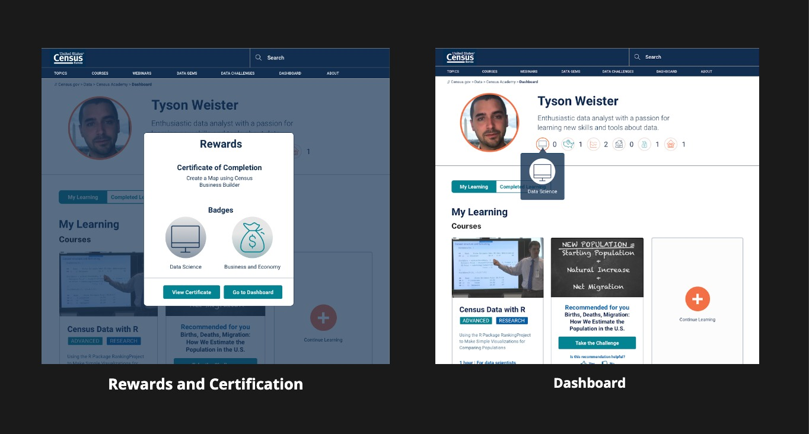

- **Reward system:** Badges were a way to help us easily reward users with short-term gratification and gamify the online courses to make them more personal.  This was something that was important to our Census Academy team, as we ideated on how we could leverage badges as a marketing opportunity. For example, the more badges you have, the more exclusive access into training, webinars, or business-related events that you have. 

- **Certification:** Certification can be really powerful for small businesses in demonstrating their expertise if in a data-adjacent field. We wanted to give this option as a way for small businesses to offer more advanced training for employees if needed. When we went onto validate our findings through user research, we found that this was a popular option among our participants. 

- **Track learning and Recommendations:** The dashboard is where users can resume courses at will, taking into account the often busy schedule of small businesses. Through the dashboard, users can also get suggestions on courses that they should take using the card layout designed for course discovery. 

--- 

## Validate

To test our new course design, we developed a challenge to teach the User Group how to use Census Business Builder with over 20 questions and follow-ups and two guided activities through the prototype. We gathered usability tests that we conducted during our research into a report shared with our team and the Census Business Builder developers on the accessibility of Census products. [Please contact me](mailto:amyflo@stanford.edu) if you’d like to learn more about our user research. 

> “Having the walkthrough of the data [from the course] was the most beneficial. I got to see the potential of the data. To me, that's the real power of the site.” - Participant 5

From our user interviews with six small businesses, we gained valuable insights into the future of the product! While I didn’t stay on the team to work on this further, here are a few suggestions from our interviews that are in the works:

#### User Suggestions

- Would like an interactive walkthrough of Census Academy
- Would like the ability to share completed courses and Data Challenges on LinkedIn
- Would like certification for mastering a course or multiple Census tools instead of certificates for just one tool.

---

## What’s next?

This redesign was presented to the leadership and the Director of the U.S. Census Bureau during the Civic Digital Fellowship Demo Day. The project was also submitted to the U.S. Census Bureau’s 2021 Transformation Showcase. This was also my very first time working on a UX project – and I’ve learned so much along the way! 

---

### Takeaways

#### Takeaway #1

If I were able to continue working on this project, I would definitely prioritize building a more clear design cycle into the team. Looking back, I had ten weeks to redesign an entire website – that was really challenging for me as a new designer. I would have benefitted by ingraining a more clear structure and outline to my work.

#### Takeaway #2

One of the hardest things for me after my fellowship with the Census was learning that this project was put on hold due to funding from the pandemic. While I really loved my internship and my work, I could have instead focused on a smaller aspect of the project that could be easily shippable as a proof of concept.

#### Takeaway #3 

This was my first UX project – ever! It opened my eyes to the world of product design ahead of me. I came into the project with a graphic design background and left so much stronger! As my first internship, I often felt imposter syndrome when presenting ideas or getting feedback on designs. Looking back, this experience taught me how to be more confident in public speaking and communicating with a team.