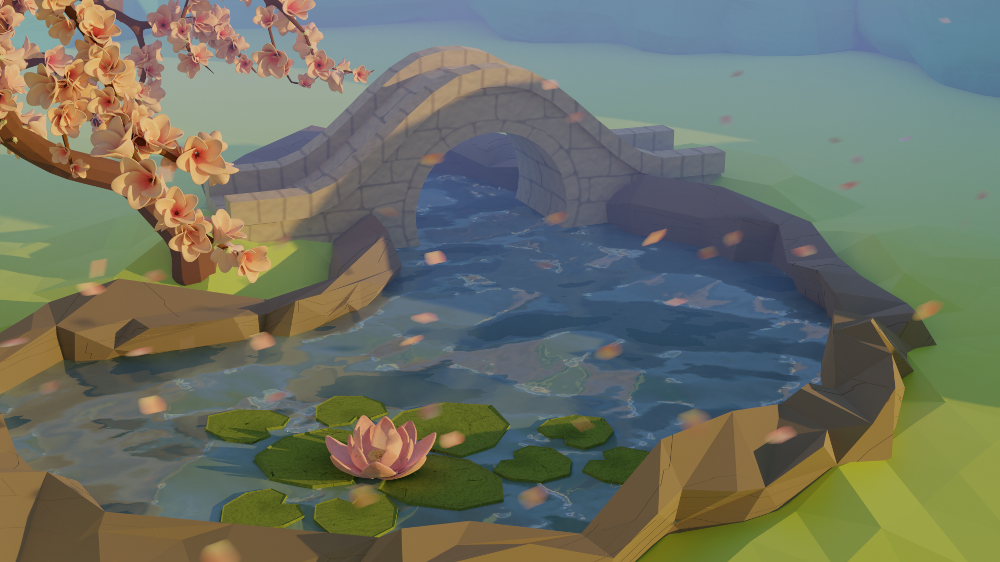
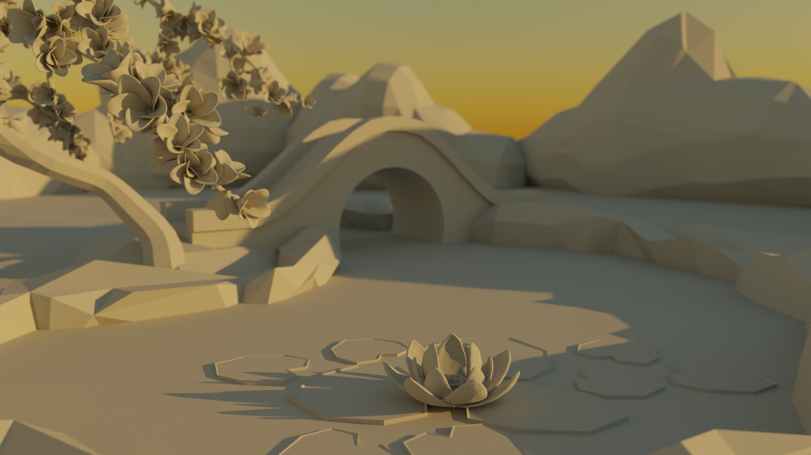
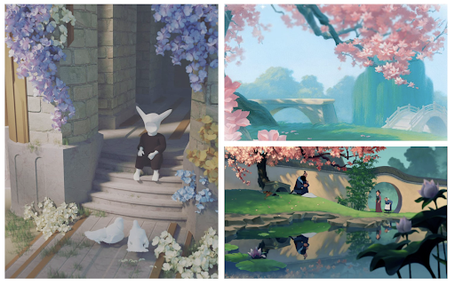

## At-a-glance

Our ray-traced image used Blender Cycles to generate a Mulan-inspired scene for CS 148: Introduction to Computer Graphics. We modeled the geometry for the trees, stones, water, the bridge, and the ground from scratch. The bridge, lily pads, lotus flower, and tree were custom UV-unwrapped and painted in Photoshop. The water and stones' texture were procedurally generated. Petals and cherry blossoms used a phsyics-based particle system to generate, and additional features such as volumetric emission, depth of field, motion blur, and denoising were added to the scene. 

    

        <h3>My Role</h3>
        
Procedural Materials 
        Lighting 
        Physics-based Particle Systems 
        

    

    

      <h3>Tools used</h3>
      
Blender Python 

    

    

      <h3>Team</h3>
      
Vivian Xiao

    

    

      <h3>Timeline</h3>
      
3 weeks, March 2021

    

---

## Project Overview

I worked on procedural materials for the water and stone, lighting the scene and sky, an emitter for floating petals with motion blur, a hair particle system to scatter cherry blossoms on the tree, and denoising in the scene. I also collaborated with my partner on adding volumetric emission and depth of field, and the layout and camera placement for final renders. Feel free to [contact me](mailto:amyflo@stanford.edu) if you would like to learn more.

  

    
    <figcaption>A different angle looking over the full scene.<figcaption>
  

  

    
    <figcaption>Volumetric scattering cube and textures removed.<figcaption>
  

---

## Concept

We wanted to create a garden scene featuring a pond with lily pads and a cherry blossom tree. My partner and I wanted to achieve a stylized look to our scene inspired by low-poly artwork with a touch of realism. We wanted our image to be resemblant of a relaxing, garden scene you’d see in Mulan – to evoke a quiet, tranquil quality. Games like Animal Crossing: New Horizons were also an inspiration for the setting and mood of our scene, especially how they blend bright, pastel colors with a soft, understated look.

In our image, we combine the still mountains and greenery with elements of movement in the reflections of the water and the floating cherry blossom petals. The viewer is meant to peer at the view, focusing on the lotus flower on the water. We set the camera with the lotus off-center, framed by the cherry blossom tree and the floating petals to guide your eyes into the bridge to the distant mountains.

### Moodboard

The cherry blossom tree was inspired by the garden scene from Mulan. The composition of lily pads in a pond surrounded by stones was also inspired from the scene. From the left image, we were inspired by the lighting and intricacy of the steps and blossoms. To accomplish this in our project, we used volumetric emission to create a hazy, dream-like effect for our image.

<!-- 
## Scene Evolution

### Modeling Geometry

We started by building the main geometry in low poly style, using a combination of custom made objects and imported models. For this scene, we built geometry in a low-poly style based off of a YouTube tutorial by Polygon Runway

### Texturing

#### Bridge

We simplified the bridge geometry since the scene looked too complex with the railings. The bridge was UV unwrapped and we created a custom texture to show a brick pattern.

#### Lilies

The lily pads were downloaded from a 3D model. We UV unwrapped them and created a custom texture to add some leaf-like designs to the flat surface.

### Procedural Material

#### Water

We started the procedural material of the water based off on a Youtube tutorial by Toby Rawal. After creating the texture, it looked a little too artificial and resembled a swimming pool more than it did a pond. Another issue was our geometry. It was originally composed of a structure, but we had to replace it with a mesh that we subdivided and extruded as a plane.

Then, we added water to the scene. At this point, it was showing up but not reflecting shadows or objects in the scene well, so we added a Glossy BSDF and mixed it with our other texture nodes to create a better effect. Eventually, after some adjustments in lighting and strength, we ended up with Musgrave texture nodes combined with bump nodes for both Principled BSDF and Glossy BSDF in a Mix Shader.

#### Stone

For the stones around the pond, we wanted to give them a little texture while still retaining some of the low-poly style.

To do so, we based our texture node roughly off our learnings from the water, adding Voronoi and noise texture nodes multiplied together, then applied with a bump node to the Principled BSDF. This helped give our stones some striations and bumps without affecting the geometry too much since we wanted a subtle look

### Particle System

## Processing

### Motion Blur

### Denoising

### Lighting

### Volumetric Effect

### Depth of Field -->
