[Play SpaceMail online](https://kalechipps.itch.io/spacemail)

## Artist’s Statement

SpaceMail is about working as a space package delivery person who is thrust into the midst of an interplanetary political rebellion. The game takes place in the Proioxis Galaxy, humanity’s first and largest space colony, which is ruled over by the oppressive regime known as the Command. The game opens shortly after the collapse of the Resistance, a rebellion movement that attempted to overthrow the Command but failed. The main character, a former rebel, is punished for their role in the Resistance by being relegated to a menial package delivery job in order to pay the bail for their imprisoned family members.

SpaceMail follows the player’s first three days on the job, across which they deliver packages between the five planets of the Proioxis Galaxy. The game follows a scripted sequence of packages—at first, the packages are fairly innocuous, but as the game progresses, the packages begin to reveal a deep secret: a second Resistance movement brewing, and the player has the power to stifle or empower the nascent rebellion by which packages they decide to deliver or incinerate.

Player decisions are the core of SpaceMail. Player decisions about early packages affect the progression of the story. Players must balance between performing their job well enough to not get fired and also making calculated mis-deliveries in order to push the story in the direction that they want. Ultimately, the choice is theirs on how they wish to progress the story, and different play-throughs will yield different narrative outcomes.

## Target Audience

We wanted SpaceMail to be accessible for many different audiences while still telling a compelling, morally gray story. Therefore, we adopted a friendly, cartoonish mood with the art that we paired with a relatively serious, morally-gray story about hardship and political rebellion. Our hope is that many audiences will enjoy SpaceMail, but we think its reliance on nuanced storytelling means it’d be a particularly good fit for adolescents and older, or anyone who is introduced to ethical decision-making at an early stage.

## Our game at a glance

### Visual Map of the Game

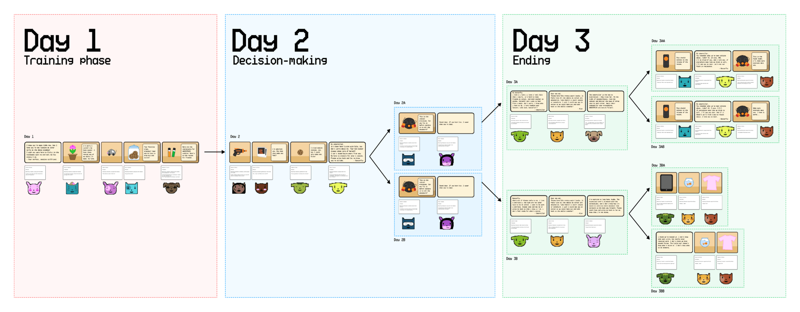

### Core Gameplay Loop

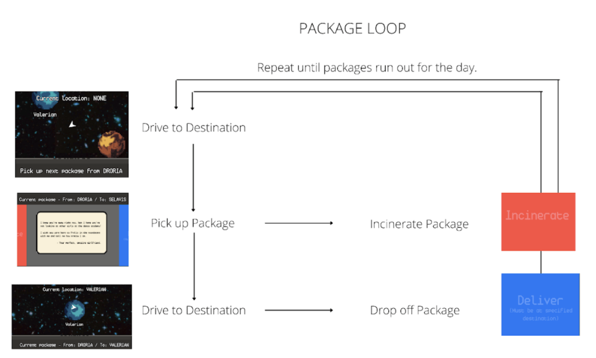

### Narrative Architecture and Use of Space

SpaceMail is a love letter to games as an interactive storytelling medium. Inspired by some of our favorite games like Papers, Please and Episode, we made SpaceMail to explore games’ ability to allow players to participate in a story as it unfolds. For example, in SpaceMail, the player can change the progression of the story through their decisions of which packages to deliver or incinerate.

While all games in the interactive storytelling genre possess some spatial qualities (they all consist of exploring a narrative tree, which is a kind of story space), our main contribution to the genre is our addition of a literal spatial component, wherein the player physically moves around the world in order to deliver packages. We hope that this addition of a literal spatial component on top of the narrative space included in all story games makes the story of SpaceMail come alive for players by compelling them to explore and contemplate the game world while simultaneously exploring the story.

### The spatial component in our game

Players use the arrow or WASD keys to fly around different planets.
Stated formally, of the four types of narrative architecture proposed by Henry Jenkins, our game falls under the “enacting stories” format. SpaceMail tells a spatial story where the player experiences the story both in the literal game space (piloting their ship between planets) and in the narrative space (navigating different branches of a narrative tree). Like Jenkins proposes, the story of SpaceMail is more a collection of episodes than a tightly scripted plot, where players learn the plot of the game through glimpses of relatively unconnected micro-narratives (e.g. the sisterly relationship between Caterpillar and Butterfly, the cookies traded between grandmother and grandson, etc.). In Jenkins’ words,

> Spatial stories are held together by broadly defined goals and conflicts and pushed forward by the character’s movement across the map.

A perspective that certainly describes the narrative of SpaceMail, which has a general overarching goal but otherwise tells a story through micro-narratives that are scattered throughout the game space (the galaxy) and story space (the branching narrative tree).

## Key Design Choices

We’re proud to be able to say that we custom-designed all of the art, sound, and code for SpaceMail, and we think this allowed us to nail our intended “approachable yet serious” tone.

### Pixel art

We opted for a pixel art style to help us set the mood for our game. We wanted to bring a nostalgic feel and honor the space-themed games of the past like Space Invaders. We also wanted our players to focus on the narrative first and foremost, which a simpler art style can help achieve. 

### Character design

Every character in the game is visually unique. I created 39 different characters, each tied to a specific planet and identity. Each character’s color palette and design are linked to their home planet.

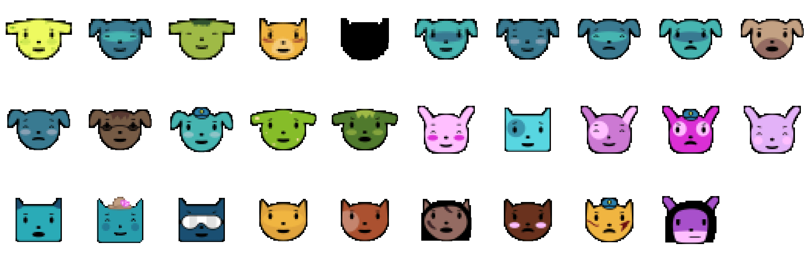

### Package design

We went through several iterations – at one point even thinking about having a package scanner in the game. We also experimented with having separate items show up on screen. Ultimately, we decided on a modular approach to packages that would simplify the types of mail you see on screen: item, letter + item, and letter. 

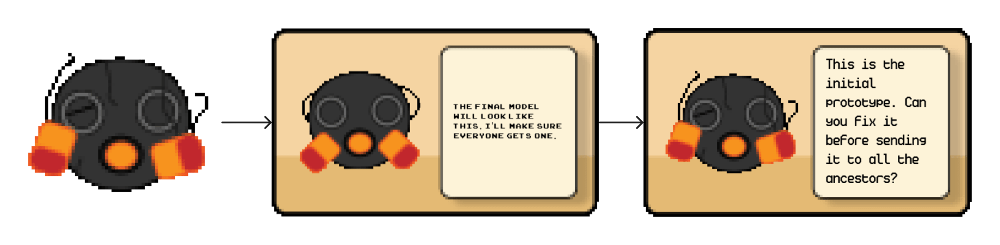

### User Interface design

Our UI is largely inspired by swiping apps like Tinder, where your user action is mostly binary (swipe left or right). We wanted to keep as little text on screen as possible as not to distract from the packages themselves. 

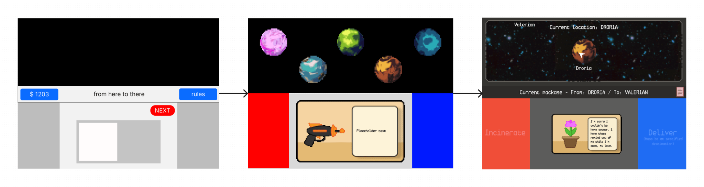

### Sound Design
We composed lo-fi music aimed to comfort the audience and sound effects to go with the physical actions in our game to enhance the satisfaction of completing tasks. 

Game soundtrack
Incinerating a package

## Design Process

### Initial Decisions

We approached this project not knowing what idea we wanted to pursue, but we wanted to listen to Christina’s advice not to compromise and try to create a mashed-up version that took only a little bit of everyone’s idea. Instead, to start the ideation process, we did this exercise where we cut up small bits of paper (10 for each person) and spent 30 seconds writing down one idea for each bit of paper – an activity called “Crazy 8’s”.

After generating ideas separately, we evaluated them together. This looked like us each marking the ideas that we liked on the bits of paper and discussing the ideas that were most popular.

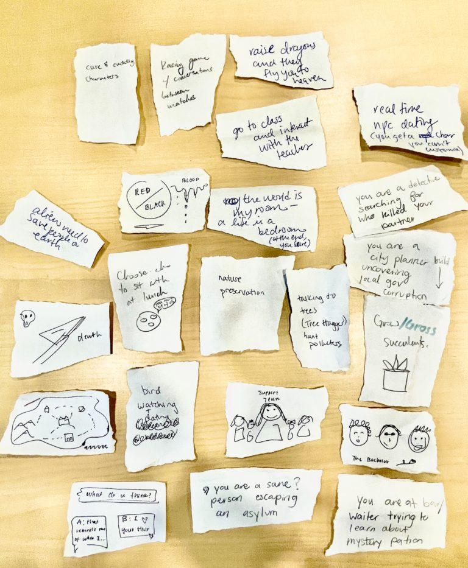

During this discussion, we used a whiteboard to write down what elements from each idea we liked. It was in this process where we began to notice resonance, for example, interest in creating a well-rounded ambiance and creating a fantasy/space theme. This was the start of us coming up with the fundamental formal elements that our team hoped to create as well as the space premise of our game. 

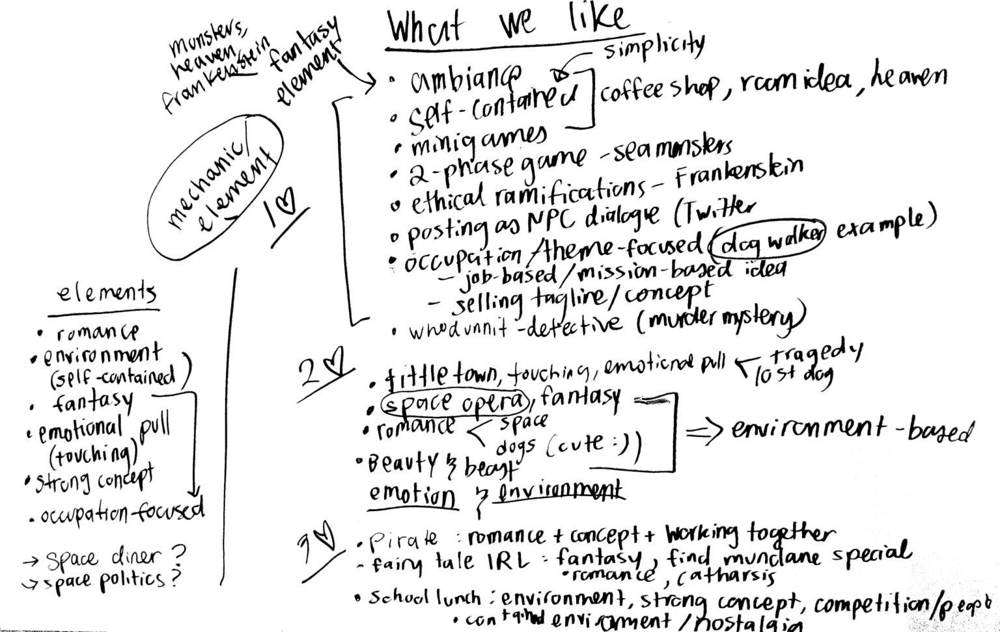

Once the premise was formulated, we went through several rounds of discussing what narratives we wanted the game to tell which included the space premise and the mechanics that we agreed upon. This looked like many white-boarding sessions in which we pitched more cohesive plans that told the game idea from start to finish.

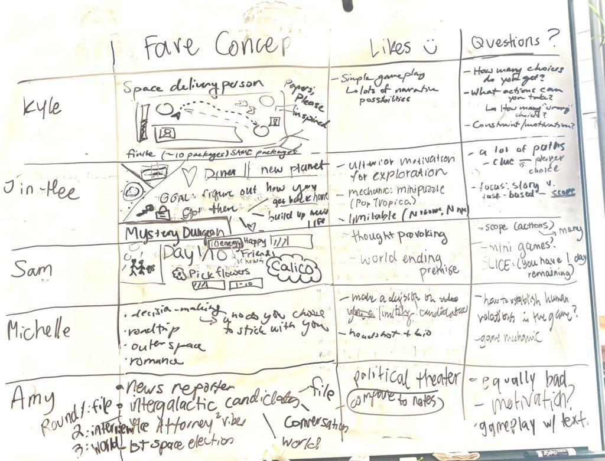

After each pitch, we discussed, refined, and pitched again. Ultimately, we narrowed it down to the idea that we would pursue.

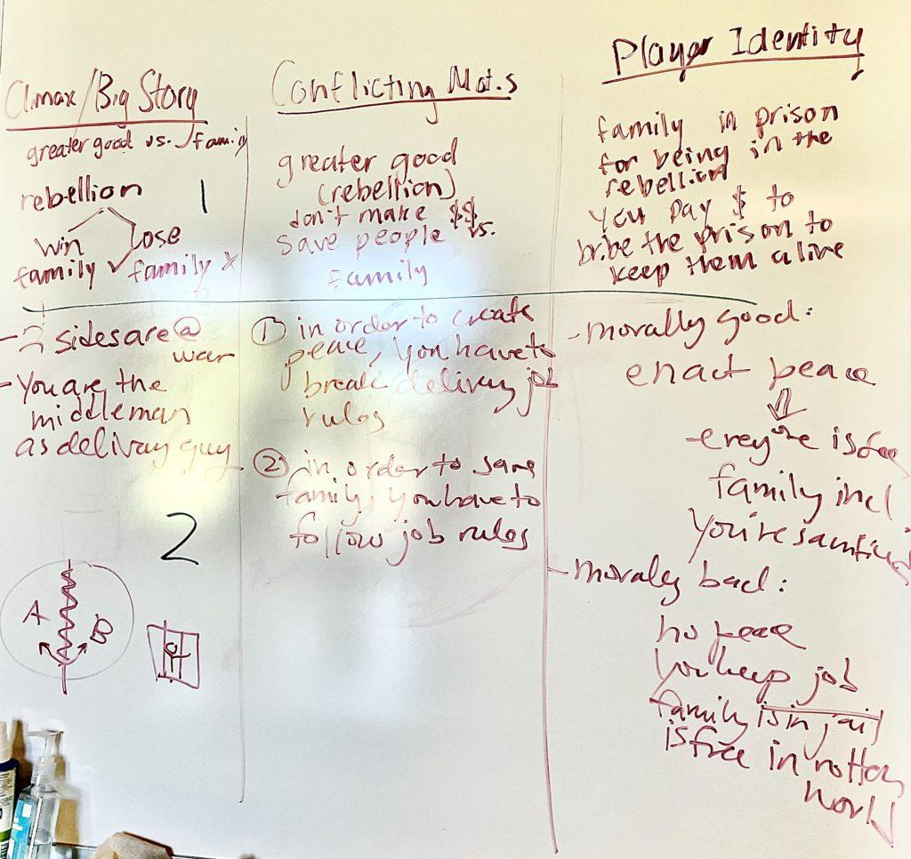

Now that we developed the idea of the game with greater detail, we needed to formalize and decide on the mechanics of the game. Getting a better understanding of the storyline actually helped us develop a natural set of mechanics that matched the story and objective of the game.

We mapped out a flowchart for different paths that the game play could follow. Given the package-delivery premise of the story, we could create “good” and “bad” kinds of packages that tested the morality of the player.

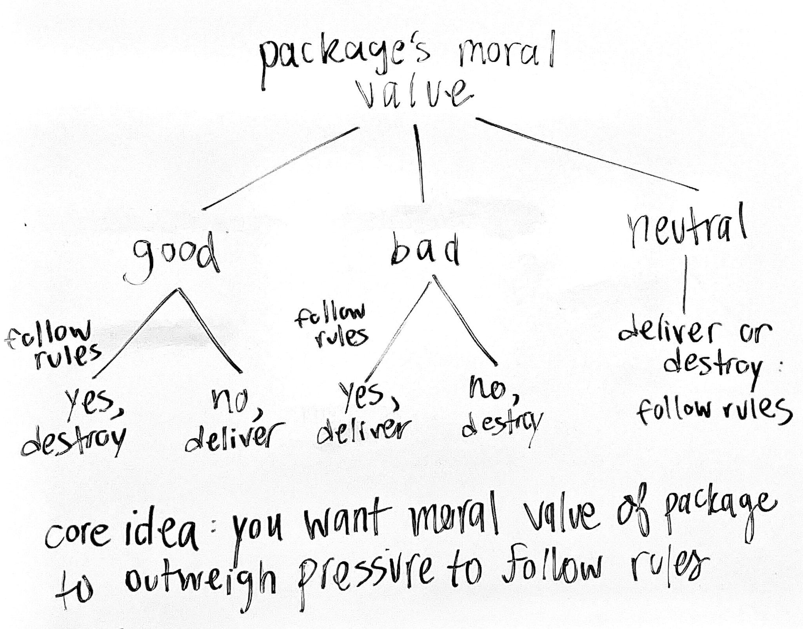

These paths in turn could propel the game forward, as the player’s decision-making in delivering packages could help them with their position in the game (e.g. bailing out family members, assisting the resistance with which they felt loyalty towards). Mapping out our storyline and a flowchart for player decisions helped us decide on initial mechanics of the game such as delivering and destroying packages. 

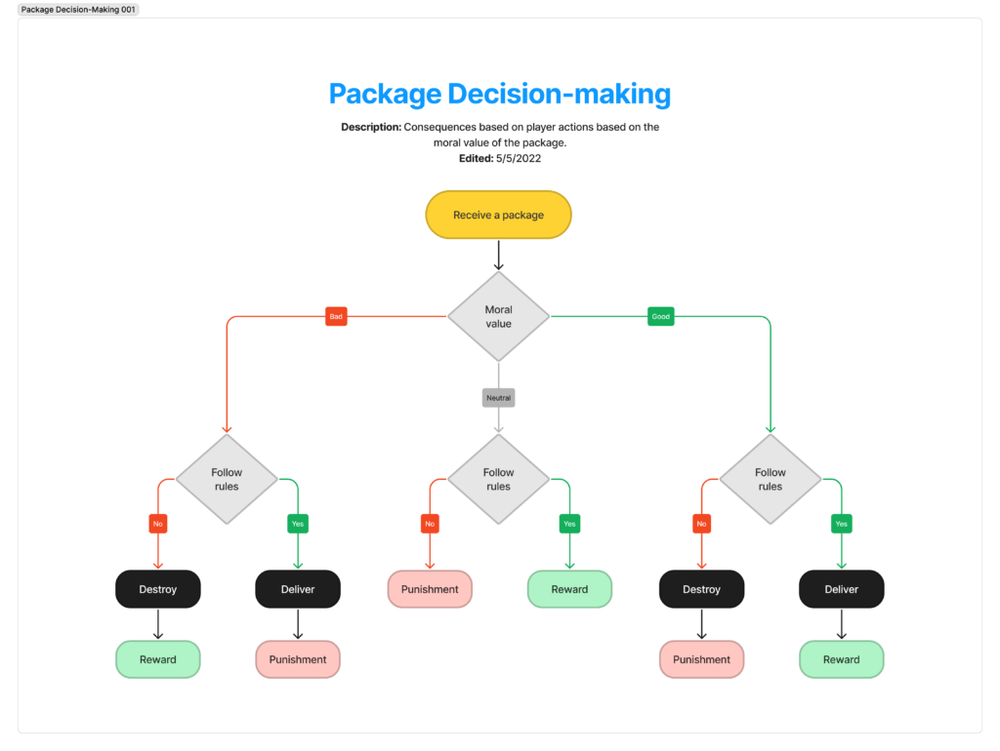

## Playtesting
In total, we conducted 12 playtests. Since our game was always designed to be a single-player game, we tested our game with 1 playtester at a time. Our process involved the playtester, a moderator – which was especially necessary in the earlier stages when we had to manually navigate through the different paths – and a notetaker. Unless the question completely prevented the player from moving forward, we did our best to refrain from questions such as, “Am I allowed to ____” to see which directions the player went in based on their own intuitions. 

Overall, we used our feedback from playtesters and round-table discussions with our team to guide our * Design Changes throughout the process. Once we cemented the premise of our game, we focused on making small changes – only 1-3 at a time depending on their scope – before our next iteration of the game. For the sake of our report, we’ve only included the major changes.

### Idea A: Brainstorm – Roleplay
A dating simulator, in space. You are the royal heir of your space colony, and you date other royal heirs in the other colonies of the galaxy. You go on dates in a space diner, which is the central hub for all of the action. The player experiences conflict between which marriage is best for their people (better resources, power, etc.) and what their heart is telling them (better chemistry, storyline). 

Per the advice of our TAs, our moderators role-played the different characters in this game with playtesters to examine how they might respond to different situations. This helped us discover the types of reactions different situations would invoke and later offered great insight into what scenarios were most interesting to people.

* Likes: conflicting motivations, introspection / assessment of your own values, space and lo-fi atmosphere.
* Areas for Improvement: How would you avoid having 1-2 obvious choices? unclear when it would end.
* Design Changes Moving Forward: keep the morally gray component but try a different premise. This change was the biggest leap since we were in a very early stage and were still finalizing our concept.

### Idea B: Low Fidelity – Paper Prototype
You are a space delivery person who faces morally gray packages each day, and it’s up to you whether or not to actually deliver them. The game ends after a set number of days. Inspired by Papers, Please by Lucas Pope.

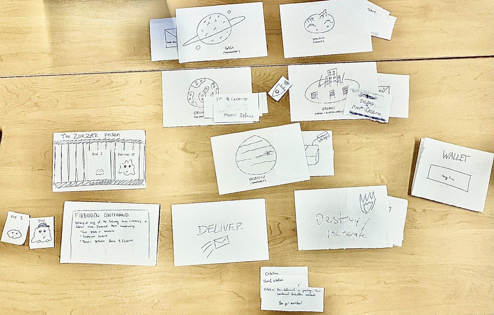

Before we had anything digital, we tested an early conception of our game using a paper prototype that worked relatively well because our game deals with letters and packages that we could simply draw. This gave us the chance to present our game in a way that focused on narrative and tested the core mechanics, such as the binary deliver vs. incinerate option and when any given day ended.

> “[This package] makes me feel bad, but I guess it’s not contraband. I have to incinerate even though it has a really cute note.” 
> *- Khuyen, 5/3*

* Likes:
  * The balance between sillier packages and morally heavy ones
  * The simple binary mechanic making it easy to learn.
* Areas for Improvement:
  * Took a while to comprehend that the destinations were distinct planets
  * Hard to know which packages are relevant
  * Confusing what can be done with the money that you make
* Design Changes Moving Forward:
  * Put more thought into the onboarding process that immerses the player in the world
  * Connect the packages through 1 significant overarching narrative
  * Remove money as a package component

### Idea C: Medium Fidelity – Interactive Slides 
B, but we’ve added an overarching narrative in which the packages are connected and you must piece them together. Multiple endings that change based on your choices.

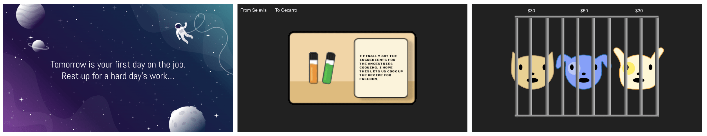

After we delegated the roles in our team, we agreed that we would playtest a simplified version of the narrative of our game that still allowed the player to work with the same mechanics. This is because our game was still in a developing, somewhat fragmented state on Unity, and we wanted players to experience the game all the way through. This is the stage at which we drilled the paths of the game and the significance of each package to tweak the difficulty of our game for our target audience and lock down our narrative.

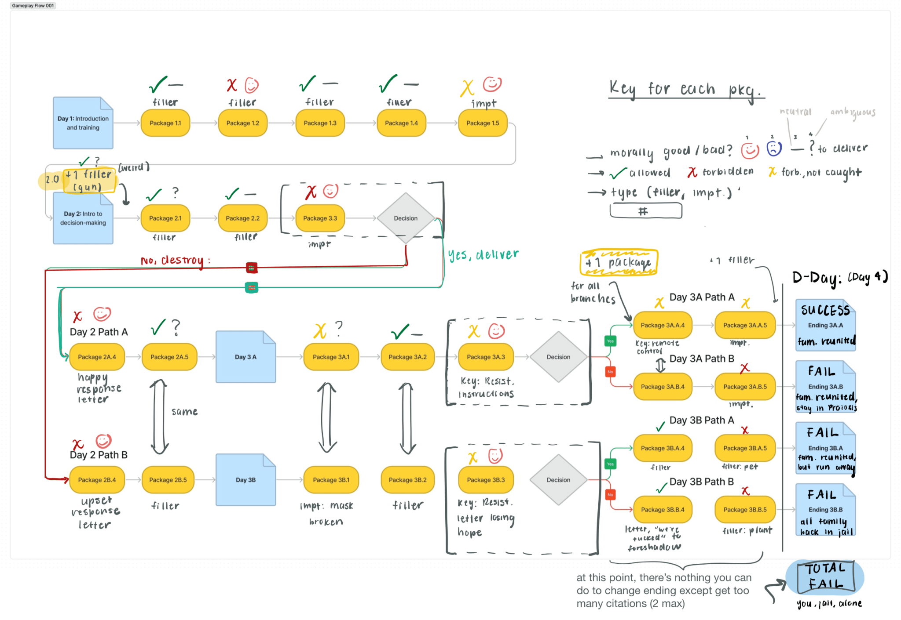

We were able to see how players reacted to the outcomes of the decisions they made and test the core loop, while presenting the atmosphere by showing spacey themes, playing sounds, and showing characters. In this version, we also had an interrogation phase where a playtester had to answer questions if they made too many mistakes – this ended up being unsuccessful!

> “When the subplots come right after each other, it’s easier to connect them. Other times, I wasn’t able to remember. If they have distinctive elements, it’s easier to see how they’re connected, like the cookie… I wanted to know more what are these planets and who am I giving the packages to.” 
> *- Esteban, 5/12*

* Likes:
  * Huge reactions after playtester failed to save family
  * Player thrill in the ambiguousness of whether or not a package would help or harm
  * Liked the multiple endings / replayability.
* Areas for Improvement:
  * Didn’t feel particularly motivated to help The Resistance
  * Zeroed-in on bailing family out of jail
  * Had to clarify rules.
* Design Changes Moving Forward:
  * Balance the motivations between political and personal
  * Make the rules more clear in the onboarding sequence
  * Remove the interrogation phase from the game

### Idea D: High Fidelity – Unity
C, but we’ve added more backstory and narrative that makes the player experience conflicting motivations between what’s best for The People (political movement) and your own family (personal tie). This meshes elements from our original dating sim into our new game idea.

Finally, we were able to bring it all together on Unity and playtest the full experience. We conducted 3 in-class playtests and 3 out-of-class playtests to get our final pieces of feedback to shape up before our final submission. The diagram shows one of our final planning sheets for the different paths of the game and how the packages factor into your outcome.

> “I’m pretty upset that I performed my job as well as possible, and I got screwed over. I think my strategy was so that they could be nice to me. I think if I played more attention to the storyline from the beginning, I probably would not be sabotaged… Maybe when I get the first citation, tell me why I got it. 
> **- Steven, 5/26**

* Likes:
  * Strong reactions to the packages themselves and to the other characters like the Foreman or your family
  * High engagement/immersion based on body language.
* Areas for Improvement:
  * Had to squint a bit to read the contents of certain letters and notes
  * Frustration at the end of the game because faithfully carrying out the job led to a bad ending
  * People kept getting lost where planets were
* Design Changes Moving Forward:
  * Increase font size on the packages/letters  
  * Give a reason why people are getting citations
  * Provide a short summary of the relevant player actions that led to the outcome so that players can replay to get a different ending
  * Label planets in the game map

### Takeaways

Looking back on our playtesting process and if we were to expand this game in the future, we think it’s important that we test on a wider age range beyond just college students. For instance, would younger teens also enjoy the minutely excruciating moral dilemma that our game aims to present?

However, we were thrilled to find throughout our playtesting process that our game evoked strong reactions in players, favorites including, “Noooooo!!! What did I just do?!?!” and “It looks innocent but… I’m sus.” We believe this is a sign that our playtesters were immersed in the fantasy that they were, indeed, a space delivery person in this politically complex galaxy and that they were following the narrative of our game.

Since we chose to make a vertical slice with only 3 days in the game, we would likely try to expand the narrative to 10 days if we had more time to develop this game. This would involve a lot of playtesting of the ramping up of moral complicatedness of each day and the packages that it presents.

We expect the challenges that would come up to include the player having to remember the relevant hints from Day 2 by the time they hit Day 8, making sure they don’t get bored throughout a longer game, and ensuring that our narrative was properly scoped to take place over a longer stretch of time. We acknowledge that we had to condense our narrative and make it feel a bit rushed because we wanted a fully playable game even though we chose to make a vertical slice, and would look forward to pacing it more slowly if we had the time.
