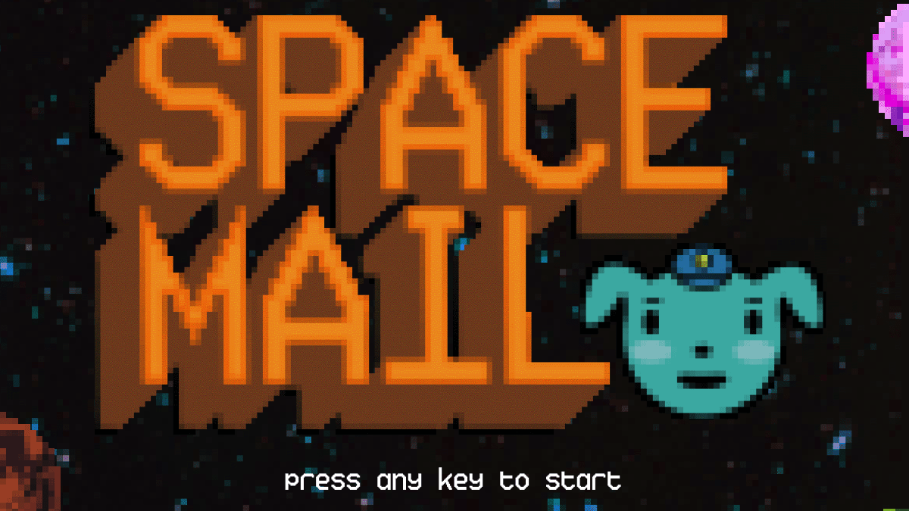

 

SpaceMail is a narrative game about delivering packages in space. Your decisions affect the course of the story, with four different endings to discover!

This project was made for CS 247G @ Stanford University. Our team made all of the assets for this project, including art, music/sound, narrative, design, and code!

### This case study is a work in progress. Check back soon for updates!

>>> [Play SpaceMail online](https://kalechipps.itch.io/spacemail)
