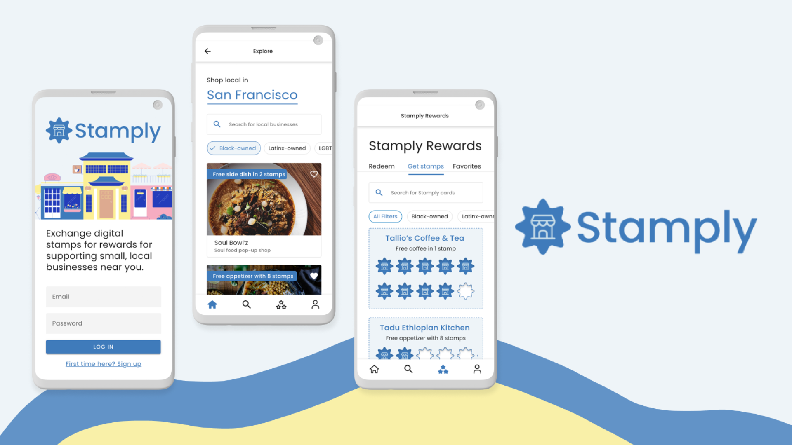

<head>
<link rel="stylesheet" href="https://unpkg.com/flickity@2/dist/flickity.min.css">
</head>

 

<!-- 

  <a href="#problem">Problem</a>
  <a href="#solution">The Solution</a>
  <a href="#research">User Research</a>
  <a href="#ideation">Ideation</a>
  <a href="#prototype">Prototyping</a>
  <a href="#presentation">Presentation</a>
  <a href="#next">Next Steps</a>

 -->

## At-a-glance

Stamply translates the nostalgic experience of getting a loyalty card stamped at your favorite local business to a digital experience that prioritizes discovery and convenience. In this concept app, I participated in a team of two with my partner, Liv Jenks. Stamply was a first place winner for [Adobe College x Ring Creative Jam](https://www.eventbrite.com/e/college-instagram-creative-jam-live-with-adobe-xd-registration-158984552075) out of 200 teams!

    

        <h3>My Role</h3>
        
Product Management 
        Prototyping 
        Interaction Design 
        Visual Design 
        

        

    

      <h3>Tools used</h3>
      
Adobe XD Whimsical

    

    

      <h3>Team</h3>
      
Liv Jenks

    

    

      <h3>Timeline</h3>
      
1 week, July 2021 (Hackathon)

    

## 01 The Problem

### The Challenge

Adobe College + Instagram Creative Jam was an event for student designers across the United States, Canada, Australia, and New Zealand. Teams had a week to work, and all submissions were scored by a judging panel of professional designers and product managers. At the Finale, finalist teams presented live to a panel of expert judges from Instagram and Adobe.

>>> Our challenge is to design an accessible third-party app for Android mobile devices that highlight people’s favorite local and undiscovered small businesses.

### Constraints

- Mobile app that solves an accessibility need
- Liv was a first-time user to Adobe XD
- Both of us were new to Android design
- Designing for low-bandwidth areas where connection may not be as strong
- Brief project timeline to complete

## 02 The Solution

The solution proposed is an Android loyalty application that uses a reward system to increase engagement with small businesses. On Stamply, you can support diverse, local businesses that align with your values and needs. You will also earn stamps for shopping small that can be used for exclusive rewards. To make the app more accessible, we also designed Stamply to be accessed anywhere, even in low-bandwidth areas, by designing a text-only version of our app.

  
  
  

## 03 User Research

### Defining the problem space

Liv and I went through the phases of the design thinking canvas, thinking clearly through the people, challlenges, storytelling, problem, solutions, management, vision and impact using the design thinking canvas. This helped us evaluate the strength of our ideas to ensure we were thinking of our users in mind.

### User flow

For the user flow, we decided on different interactions in our app based on our initial brainstorm of features. This served as a reference for us later when prototyping our design.

## 04 Ideation

### Low-Fidelity

We began with low-fidelity wireframes, trying out different versions of screens and outlining sections of our app using Whimsical. 

### Medium-Fidelity

We then transitioned to Adobe XD, where we referenced styles from Adobe XD UI Kits and applied preliminary styles from our design system to create medium fidelity wireframes. We relied greatly on Material Design principles to help us think through visual hierarchy on screen. 

### Design System

We built a modular, component-based design system to prioritize consistency and usability across our product. Our visual design takes inspiration from the brand identity of the Shop Small movement while maintaining a highly minimalistic and simple design with only a few accent colors to increase accessibility between the text-only and default modes for our app.

## 05 Prototyping

### Final Prototype

From here, we went on to implement branding, microinteractions, animations, and color through our high-fidelity wireframes. Prototyping on Adobe XD taught us how to tell a visual story through microinteractions. We took advantage of the smart-animate and timing features to make our app more interactive and realistic. View the [interactive prototype here.](https://xd.adobe.com/view/ba385aff-46f6-401d-9dd1-a2d021d96ddf-ef6b/)

<!-- <iframe width="600" height="400" src="https://xd.adobe.com/embed/d4019ede-c15f-46db-98bd-b6bfe5f81b05-8152/?fullscreen&hints=off" frameborder="0" allowfullscreen></iframe> -->

    

        
    

    

        

            

                <h4>Onboarding</h4>
                <h5>App Preview</h5>
                
We wanted to let users preview the features available and start filtering for small businesses they wanted to shop. 

                <h5>Micro-interactions</h5>
                
We added small, subtle animations for our app start screen and connecting to wifi.

                <h5>Accessibility tools</h5>
                
From the onboarding, you can opt out of location tracking to use your last saved location when connection is limited and choose to use a text-only version of the app.

            

        

    

    

        
    

    

        

            <h4>Stamply Lite</h4>
            <h5>“Lite” version for low-bandwidth connectivity</h5>
            
Stamply Lite lets users experience Stamply without media while still getting the information and details you need. Our app automatically detects when a user's connection is low bandwidth and prompts them to switch to a text-only version.

            <h5>Minimalist design</h5>
            
We prioritize showcasing essential information and details needed to discover small businesses that matter to you through a light, minimalist interface to lessen the transition between Stamply and Stamply Lite.

            

    

    

        
    

    

        

            <h4>Discover Small Businesses</h4>
            <h5>Small Business Pages</h5>
            
Learn more about a small business and its story, save it as a favorite, and stamp its card for rewards.

            <h5>Digital Stamps</h5>
            
Earn digital stamps for shopping small that can be redeemed for rewards to help businesses build a loyal customer base.Redeem using scannable QR codes and mark offers as used.

        

    

    

        
    

    

        

            

                <h4>Search & Explore</h4>
                <h5>Filterable tools</h5>
                
Flexibly search and filter by category, goods and services, and location to find businesses by BIPOC owners that mathc your criteria.

                <h5>Location search</h5>
                
When your bandwidth is low, Stamply will use your last saved location to locate businesses near you. You can also use predetermined major cities to search.

            

        

    

## 06 Presentation

### We won first place at the Adobe Creative Jam!

We received notification that we made it to the top 10 and had a few days to prepare for the next round! As finalists, we presented in the Finale with a live 3-minute demo of our app and its user flow.

#### Finalist Presentation

<iframe width="560" height="315" src="https://www.youtube.com/embed/Fl8st5-dwZc" title="YouTube video player" frameborder="0" allow="accelerometer; autoplay; clipboard-write; encrypted-media; gyroscope; picture-in-picture" allowfullscreen></iframe>

### Feedback

“I might just be old school, but I love the loyalty program aspect of [Stamply] and the gratification of getting stamps for rewards. It was done in a very simple and concise way, which was great.”

**– Paula Guzman, Product Designer at Instagram**

“It felt incredibly straightforward and intuitive to use. I appreciate the focus on ‘lite,’ having a text-only version, and I liked that that feature was mentioned early in the onboarding flow to show the value of the app.”

**– Adam Kopec, Product Designer at Instagram**

“I love that the value props are clear in the onboarding, and it’s a really lovely idea to highlight minority-owned businesses. I would definitely use this app.”

**– Celeste Lam, Creative Director at Adobe**

#### Award ceremony

<iframe width="560" height="315" src="https://www.youtube.com/embed/cypBLMjyVqo" title="YouTube video player" frameborder="0" allow="accelerometer; autoplay; clipboard-write; encrypted-media; gyroscope; picture-in-picture" allowfullscreen></iframe>

## 07 Next Steps

### Refine the visual system to be more friendly and warm

To represent our mission of supporting local businesses, it is important that we consider how best to reflect that sense of community in the visual identity of our app. Creating this approachability while still maintaining a minimal, streamlined look would be central to next iterations.

### Expand to include customer reviews and feedback for businesses

One of the pieces of feedback we got from the judges was to incorporate features that invite users to engage with the platform (i.e. by leaving reviews and feedback) to create a sense of engagement and community.

### Build business version of the app

“Stamply Business” would allow businesses to create and tailor their profiles with photo galleries, their origin/founding stories, and customize the rewards they offer customers.

