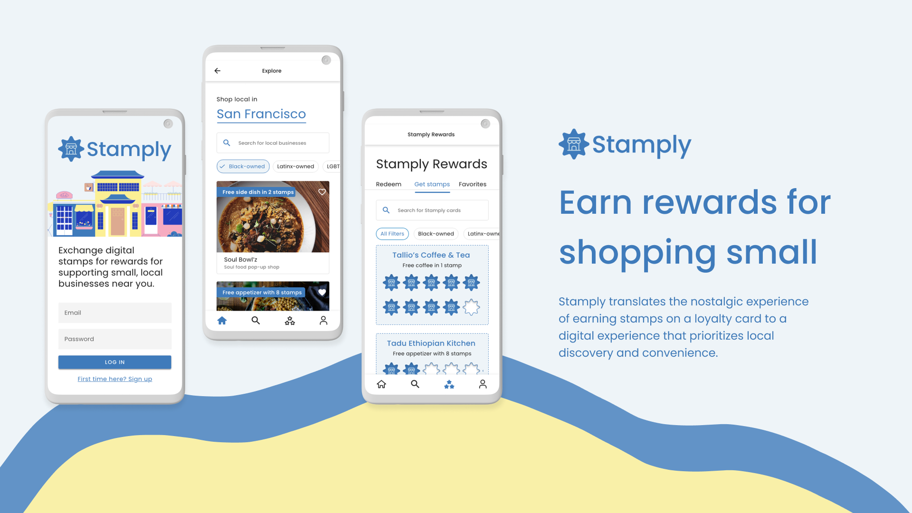
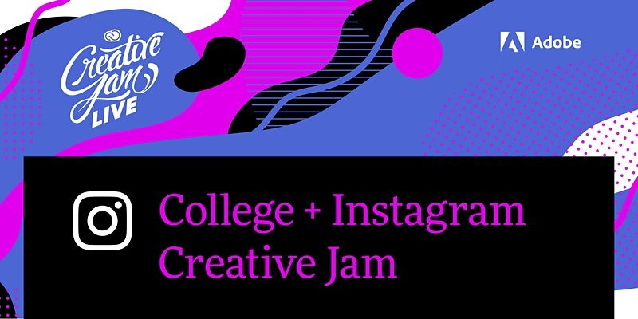
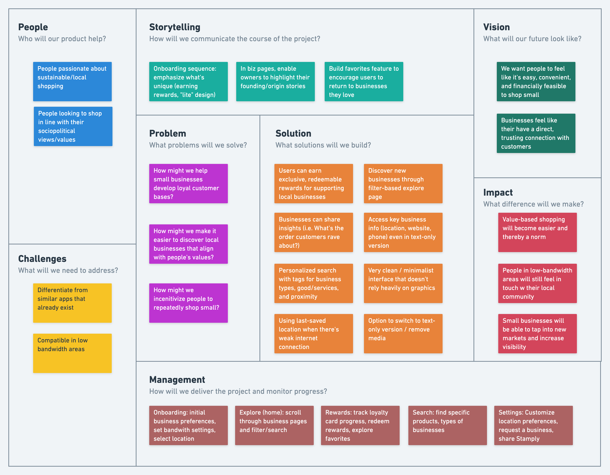
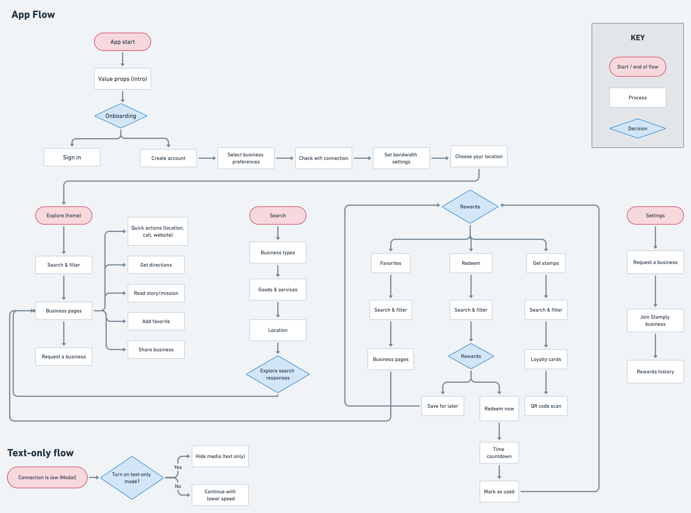
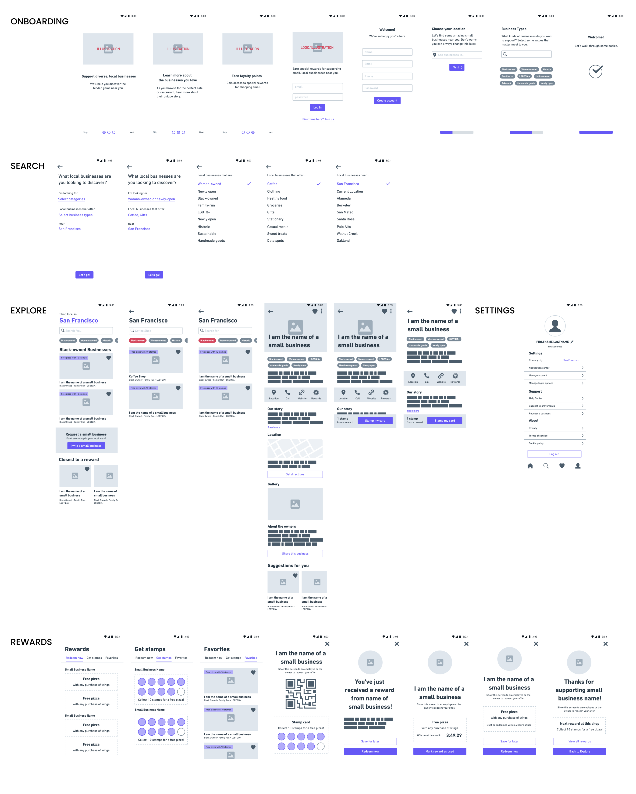
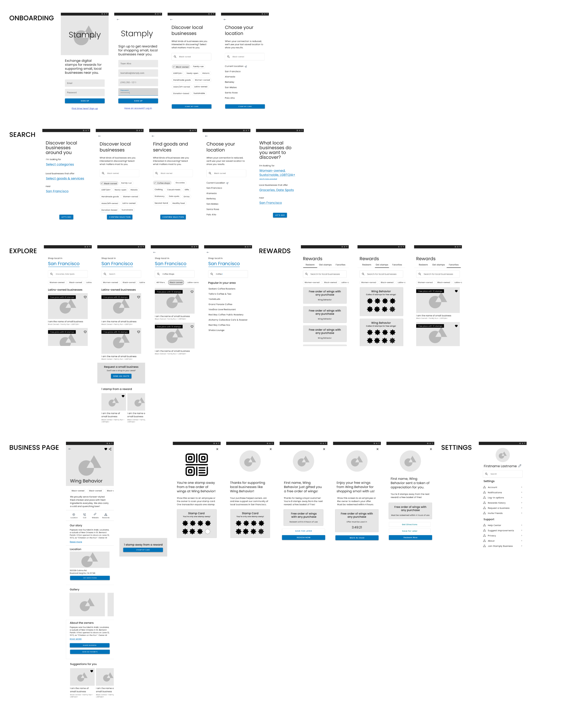
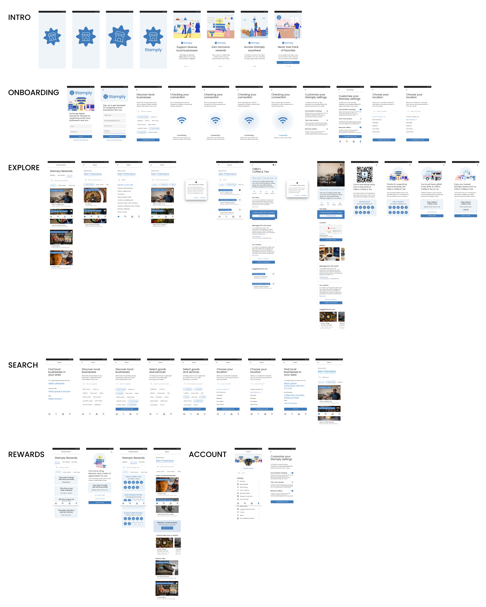
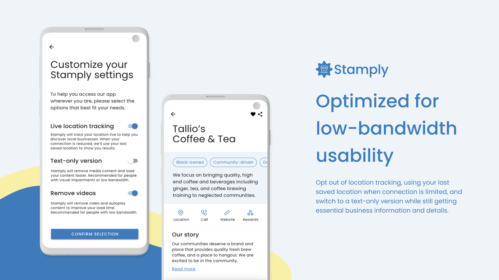
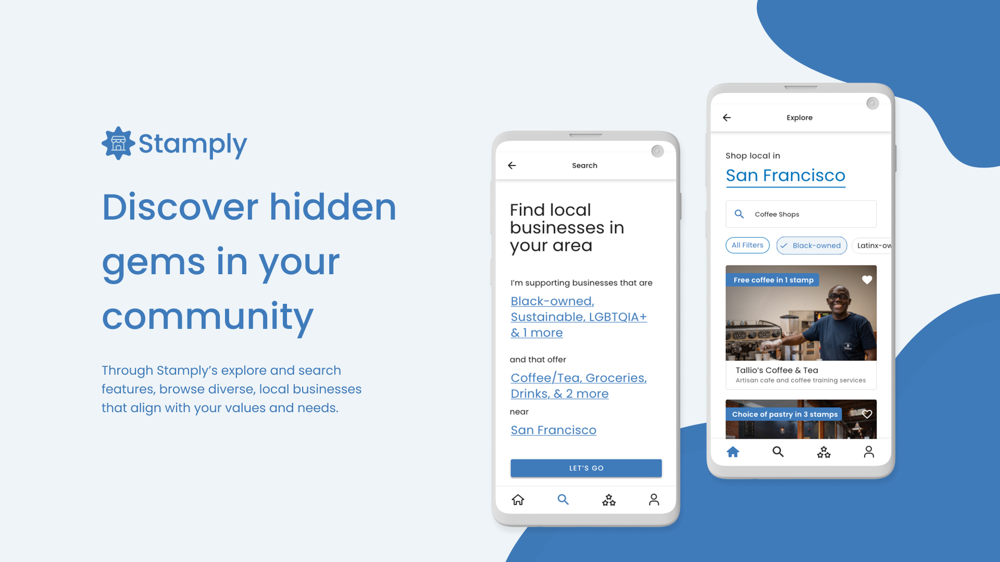
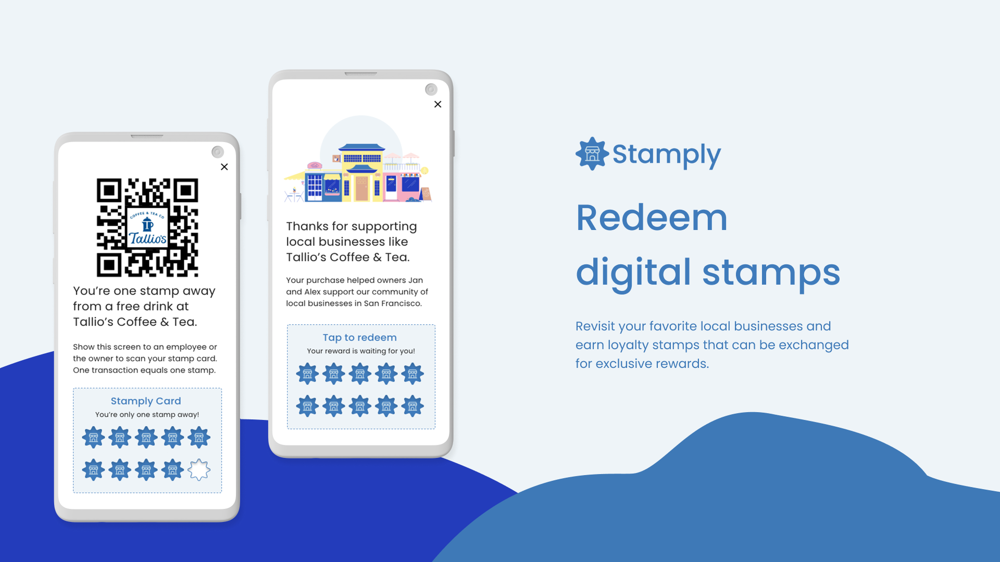

 

---

## Introduction

Stamply translates the nostalgic experience of getting a loyalty card stamped at your favorite local business to a digital experience that prioritizes discovery and convenience. In this concept app, I participated in a team of two with my partner, Liv Jenks. Stamply was a first place winner for [Adobe College x Ring Creative Jam](https://www.eventbrite.com/e/college-instagram-creative-jam-live-with-adobe-xd-registration-158984552075) out of 200 teams!

- **Team members:** Liv Jenks
- **Role:** Product Designer
- **Type:** Design Competition
- **Tools:** Adobe XD, Whimsical
- **Duration:** 1 week, July 2021

---

## Challenge

### Prompt

>>> “Your challenge is to design an accessible third-party app for Android mobile devices that highlight people’s favorite local and undiscovered small businesses.”

### Concept

On Stamply, you can support diverse, local businesses that align with your values and needs. You will also earn stamps for shopping small that can be used for exclusive rewards. Stamply is built to be accessed anywhere even in low-bandwidth areas.

---

## Overview

### Constraints

- Mobile app that solves an accessibility need
- Liv was a first-time user to Adobe XD
- Both of us were new to Android design
- Designing for low-bandwidth areas where connection may not be as strong
- Brief project timeline to complete

---

## About the event

### Adobe College + Ring Creative Jam

Adobe College + Instagram Creative Jam was an event for student designers across the United States, Canada, Australia, and New Zealand. Teams had a week to work, and all submissions were scored by a judging panel of professional designers and product managers. At the Finale, finalist teams presented live to a panel of expert judges from Instagram and Adobe.

---

## Process

### Defining the problem space

Liv and I went through the phases of the design thinking canvas, thinking clearly through the people, challlenges, storytelling, problem, solutions, management, vision and impact using the design thinking canvas. This helped us evaluate the strength of our ideas to ensure we were thinking of our users in mind.

## Ideation

### User flow

For the user flow, we decided on different interactions in our app based on our initial brainstorm of features. This served as a reference for us later when prototyping our design.

### Wireframes

We began with low-fidelity wireframes, trying out different versions of screens and outlining sections of our app using Whimsical. 

We then transitioned to Adobe XD, where we referenced styles from Adobe XD UI Kits and applied preliminary styles from our design system to create medium fidelity wireframes. We relied greatly on Material Design principles to help us think through visual hierarchy on screen. 

From here, we went on to implement branding, microinteractions, animations, and color through our high-fidelity wireframes.

### Design System

We built a modular, component-based design system to prioritize consistency and usability across our product. Our visual design takes inspiration from the brand identity of the Shop Small movement while maintaining a highly minimalistic and simple design with only a few accent colors to increase accessibility. We wanted to include a text-only version of our app for users to use in low-bandwidth situations, so we decided to make our visual identity minimalistic to focus on the small businesses and make the experience between text-only and default modes as seamless as possible.

### Prototyping

Prototyping on Adobe XD taught us how to tell a visual story through microinteractions. We took advantage of the smart-animate and timing features to make our app more interactive and realistic.

<!-- 

    <video preload="auto" autoplay="autoplay" loop="loop" controls      style="max-width: 100%; height: auto;">
    <source src="https://i.imgur.com/FiNahgC.mp4" type="video/mp4">
    </video>

 -->

---

## Solution

### View the [interactive prototype here.](https://xd.adobe.com/view/ba385aff-46f6-401d-9dd1-a2d021d96ddf-ef6b/)

<figure></figure>

> Solution #1: “Lite” version for low-bandwidth connectivity

- Switch to a text-only version: Experience Stamply without media while still getting the information and details you need.
- Opt out of location tracking: Use your last saved location when connection is limited.
- Light, minimalist interface: We prioritize showcasing essential information and details needed to discover small businesses that matter to you.

<figure></figure>

> Solution #2: Explore & Search

- Through our explore page, browse local businesses from BIPOC owners and learn more about their stories.
- Flexible search feature that allows users to filter by category, goods and services, and location.

<figure></figure>

> Solution #3: Stamply Rewards​​​​​​​

- Earn digital stamps for shopping small that can be redeemed for rewards.
- Helps businesses build a loyal, sustainable customer base.

---

## Results

### Awards

> We won first place at the Adobe Creative Jam!

Our app was evaluated on the following criteria:

1. Does the solution address a target audience and their needs?
2. Does the prototype solve the problem in an innovative way?
3. Is the user experience and interface intuitive?
4. Is visual design used in a thoughtful and meaningful way?

We received notification that we made it to the top 10 and had a few days to prepare for the next round! As finalists, we presented in the Finale with a live 3-minute demo of our app and its user flow.

> Watch Liv present our project to the judges!
<iframe width="560" height="315" src="https://www.youtube.com/embed/Fl8st5-dwZc" title="YouTube video player" frameborder="0" allow="accelerometer; autoplay; clipboard-write; encrypted-media; gyroscope; picture-in-picture" allowfullscreen></iframe>

### Feedback

“I might just be old school, but I love the loyalty program aspect of [Stamply] and the gratification of getting stamps for rewards. It was done in a very simple and concise way, which was great.” 

**– Paula Guzman, Product Designer at Instagram**

“It felt incredibly straightforward and intuitive to use. I appreciate the focus on ‘lite,’ having a text-only version, and I liked that that feature was mentioned early in the onboarding flow to show the value of the app.”

**– Adam Kopec, Product Designer at Instagram**

“I love that the value props are clear in the onboarding, and it’s a really lovely idea to highlight minority-owned businesses. I would definitely use this app.”

**– Celeste Lam, Creative Director at Adobe**

> Watch us win first place in the competition!
<iframe width="560" height="315" src="https://www.youtube.com/embed/cypBLMjyVqo" title="YouTube video player" frameborder="0" allow="accelerometer; autoplay; clipboard-write; encrypted-media; gyroscope; picture-in-picture" allowfullscreen></iframe>

## Next Steps

### Refine the visual system to be more friendly and warm

To represent our mission of supporting local businesses, it is important that we consider how best to reflect that sense of community in the visual identity of our app. Creating this approachability while still maintaining a minimal, streamlined look would be central to next iterations.

### Expand to include customer reviews and feedback for businesses

One of the pieces of feedback we got from the judges was to incorporate features that invite users to engage with the platform (i.e. by leaving reviews and feedback) to create a sense of engagement and community.

### Build business version of the app

“Stamply Business” would allow businesses to create and tailor their profiles with photo galleries, their origin/founding stories, and customize the rewards they offer customers.