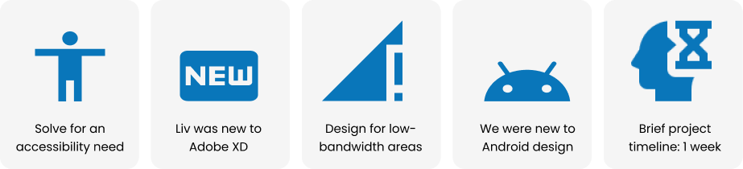
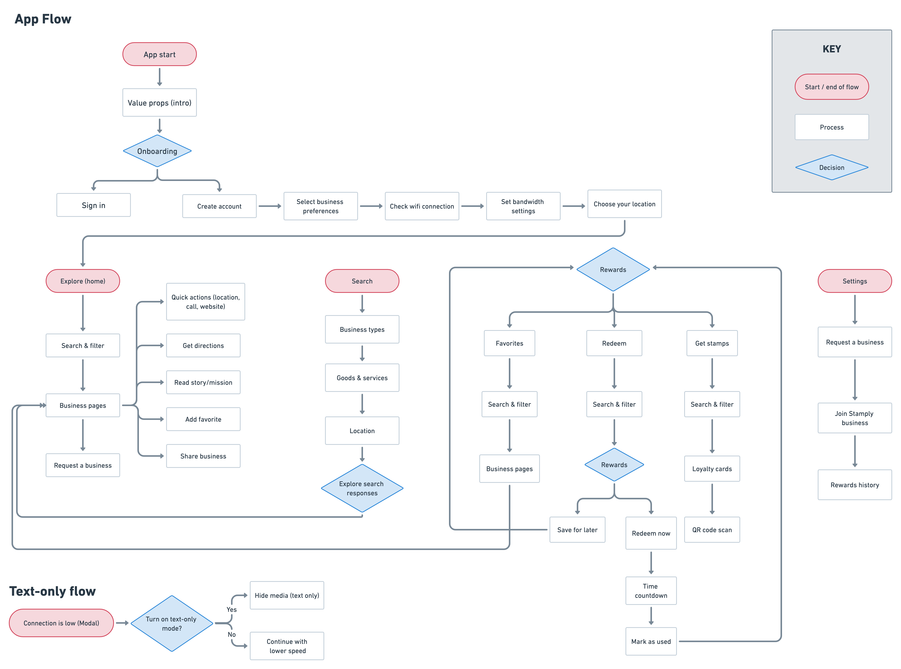

*PING!* At any given point, I can expect a random Taco Bell, Starbucks, or Target notification to ping my phone, letting me know that I can get extra points for shopping or promoting something I might like. And it works. I’m one of the **72% of US adults who belong to at least one loyalty program**, and I’m sure you might be, too.

Setting up a loyalty rewards program is expensive, with an estimated initial build and customization fee of around **$15,000-$40,000**, not to mention additional costs to manage and maintain customers. While a loyalty rewards program can be a great return on investment, it’s still a big financial risk for small businesses without the resources to sink that development cost.  

And for consumers like us, it’s not easy either. On average, we’re loyal to nine different programs across multiple industries. Juggling between several different apps and rewards systems can be confusing. It’s also harder for us to be rewarded for supporting the small businesses we love.

## What’s out there for small businesses?

We searched far and wide for a solution. We didn’t find it on the App Store or online, but in our wallets.

Before the Internet, US companies used physical stamps as their loyalty programs that customers collected in books to exchange for rewards. This evolved into loyalty stamp cards that were cheap and easy for small businesses to print and distribute to loyal customers. Loyalty stamp cards could fit in your wallet and encourage repeat purchases.

This gave us inspiration: How might we translate this analog experience to the digital world?

### The Challenge

We competed in the Adobe College + Instagram Creative Jam, an event for student designers across the United States, Canada, Australia, and New Zealand. Teams had a week to work, and all submissions were scored by a judging panel of professional designers and product managers. Our challenge was to design an accessible third-party app for Android mobile devices that highlight people’s favorite local and undiscovered small businesses. 

## The Making of Stamply

We ideated using the design thinking canvas, imagining the people, challenges, and impact behind our desired user experience. One of our key constraints was designing for accessibility for people in low-bandwidth areas with less access to the Internet. After all, one of the perks of a physical loyalty card is not needing Wi-Fi to use it.

From here, we could decide which features were most crucial and impactful. We designed a user flow map around these conclusions. We wanted to emphasize the discovery of small businesses in your area and maintain the simplicity of our concept.

The app’s initial design included filtering businesses by category and a scannable QR code for small businesses to digitally “stamp” your card. 

### Medium-fidelity demo

One idea that arose out of our low-fidelity wireframes was a text-only version of Stamply to maximize accessibility of our app in low-bandwidth areas. We decided to expand on this idea in our medium-fidelity wireframes, always asking ourselves: What is the minimum we need to offer maximum impact in our design?

<iframe width="100%" height="600px" src="https://xd.adobe.com/embed/39e41b85-775a-46f4-945d-e0009bcbd618-6cb7/" frameborder="0"></iframe>

### High-fidelity demo

Our latest iteration of Stamply focuses on showing you small businesses you want to support with an efficient rewards process for the consumer. With just a quick QR code scan, businesses can easily “stamp” your card. Our overall goal was to create an app that would make it easier to shop at diverse, small businesses and get rewarded for it. With a highly minimalistic design, consumers can easily transition between the text-only and default mode for Stamply without missing out on functionality.

<iframe width="100%" height="600px" src="https://xd.adobe.com/embed/d4019ede-c15f-46db-98bd-b6bfe5f81b05-8152/" frameborder="0"></iframe>

## Awards

We won first place at the Adobe Creative Jam! At the Finale, we presented live to a panel of expert judges from Instagram and Adobe.

<iframe style="padding: 30px" width="1000" height="600" src="https://www.youtube.com/embed/Fl8st5-dwZc" title="YouTube video player" frameborder="0" allow="accelerometer; autoplay; clipboard-write; encrypted-media; gyroscope; picture-in-picture" allowfullscreen></iframe>

### Feedback

> I might just be old school, but I love the loyalty program aspect of [Stamply] and the gratification of getting stamps for rewards. It was done in a very simple and concise way, which was great.
>
> **– Paula Guzman, Product Designer at Instagram**

> It felt incredibly straightforward and intuitive to use. I appreciate the focus on ‘lite,’ having a text-only version, and I liked that that feature was mentioned early in the onboarding flow to show the value of the app.
>
> **– Adam Kopec, Product Designer at Instagram**

> I love that the value props are clear in the onboarding, and it’s a really lovely idea to highlight minority-owned businesses. I would definitely use this app.
>
> **– Celeste Lam, Creative Director at Adobe**

## Moving Forward

### Refine the visual system to be more friendly and warm

To represent our mission of supporting local businesses, it is important that we consider how best to reflect that sense of community in the visual identity of our app. Creating this approachability while still maintaining a minimal, streamlined look would be central to next iterations.

### Expand to include customer reviews and feedback for businesses

One of the pieces of feedback we got from the judges was to incorporate features that invite users to engage with the platform (i.e. by leaving reviews and feedback) to create a sense of engagement and community.

### Build business version of the app

“Stamply Business” would allow businesses to create and tailor their profiles with photo galleries, their origin/founding stories, and customize the rewards they offer customers.
