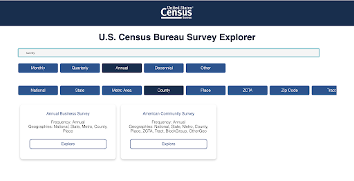
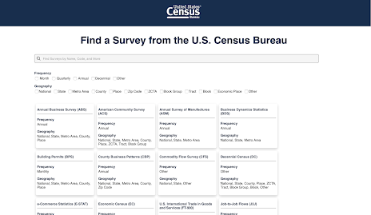
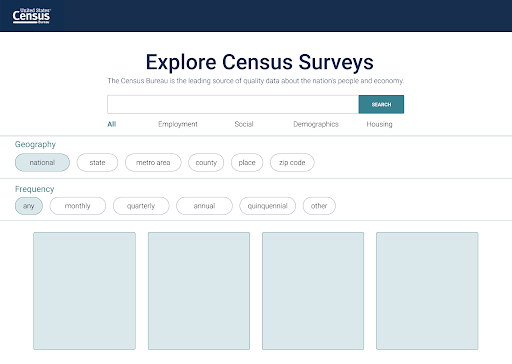
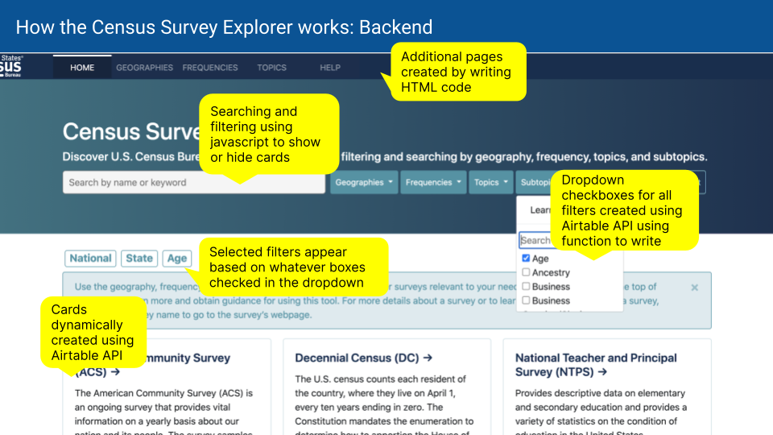
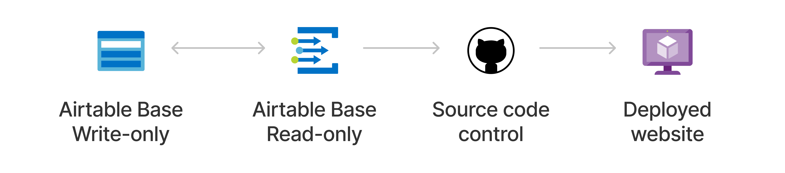

## At-a-glance

Previously, when exploring surveys from the U.S. Census Bureau, one of your only options was to search through an [alphabetical list of surveys](https://www.census.gov/programs-surveys/surveyhelp/list-of-surveys.html). However, it was difficult for users to narrow down surveys based on important criteria or get a quick overview of the surveys available. The Census Survey Explorer aims to help users to filter and customize their search by frequency, geography, topics, and subtopics and is [now live on the U.S. Census Bureau](https://www.census.gov/data/data-tools/survey-explorer/) site under the Surveys/Programs section. See the [Github project here](https://github.com/uscensusbureau/censussurveys).

    

        <h3>My Role</h3>
        
Frontend Developer 
        Backend Developer 
        Product Designer 
        

    

    

      <h3>Tools used</h3>
      
Javascript 
      jQuery HTML/CSS Airtable API Figma

    

    

      <h3>Team</h3>
      
Mary Leisenring 
      Eric Coyle 
      Alexandra Barker 
      Logan Powell 
      Anthony Calabrese 
      

    

    

      <h3>Timeline</h3>
      
5 months, September - February 2021

    

---

## Project Overview

I started at the U.S. Census Bureau as a Civic Digital Fellow in June 2020 through Coding it Forward. After my 10-week fellowship, I stayed to continue my work when my supervisor, Mary, came to me with a problem. She wanted a way to display all the surveys we had available for her instructional design course for Census data users, but found it overwhelming to send them a link to 130 surveys without any way to explore.

Originally designed as a data visualization project, the Census Survey Explorer has since evolved into a way to discover U.S. Census Bureau surveys or censuses by filtering and searching by geography, frequency, topics, and subtopics. I worked closely with Mary and Eric to create the content for the tool and worked with Logan on the backend and API usage. 

### Progress 

These are screenshots from when the project was developping. I ultimately landed on the final site after much iteration.

  

    
    <figcaption>Initial attempt.<figcaption>
  

  

    
    <figcaption>Creating filters<figcaption>
  

  

    
    <figcaption>An experimentation on Figma.<figcaption>
  

  

    
    <figcaption>Final site implementation.<figcaption>
  

---

## Code structure

On Airtable, content writers can edit, add topics, filters, and surveys to an Airtable base freely. Changes are automaticaly synced on an interval basis into a separate base that feeds into the website. These settings can be changed so that the sync is not automatic. Using the [Airtable API](https://airtable.com/api), the Census Survey Explorer reads in the data from the synced base to dynamically create filterable cards and dropdown filters to update pages. The Airtable API is really powerful for automatically syncing records that can be used to build content into web pages. Using jQuery and Javascript, user inputs are processed to hide or show cards that match.

 

The most tricky part of this process was learning Javascript and connecting the UI to the Airtable API. I used Bootstrap as a framework for the layout and generated a unique card for every table cell entry processed by the Airtable API. It was difficult at first to learn how to read content fromm the REST API and process data from an Airtable view as well as consolidate the different data types (text, multiple selecct, select). However, this being my very first project in web development, I am really proud and so happy to say that this project has officially launched as of March 2022, almost 2 years after it was started!
